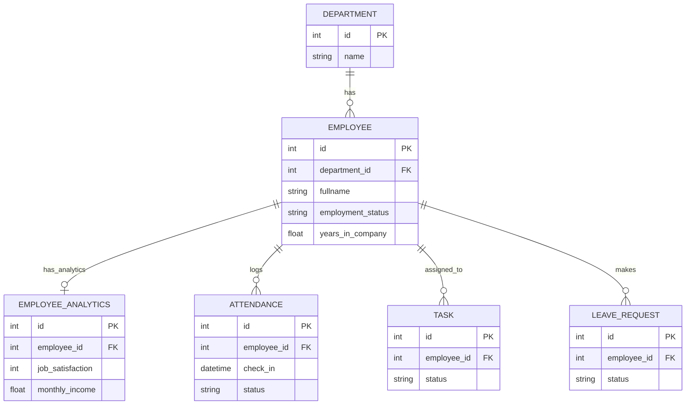
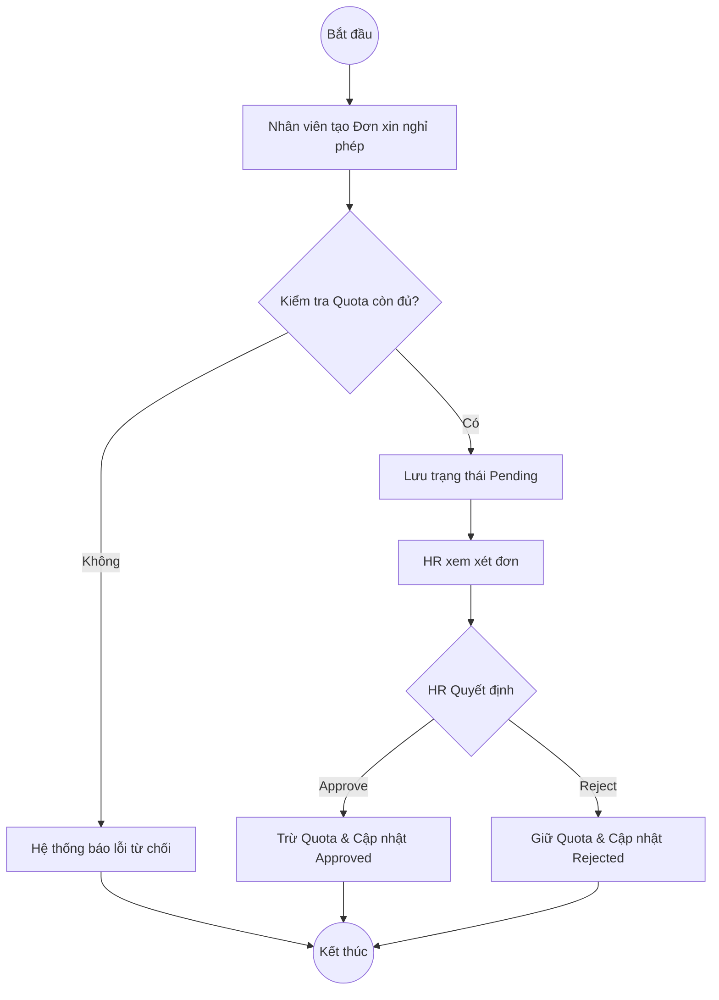
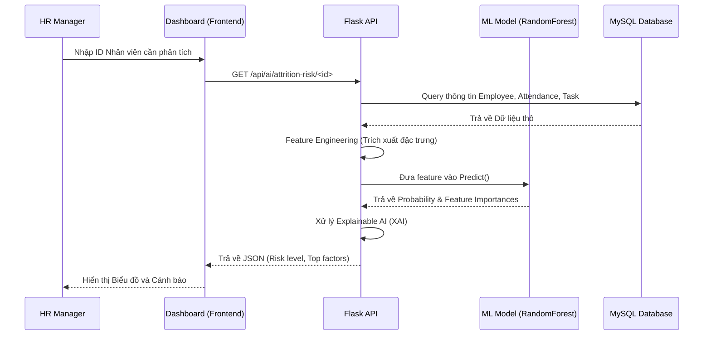
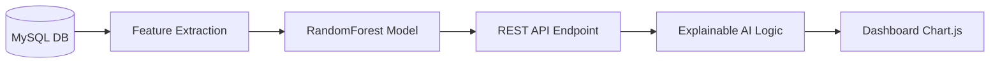

# ĐỒ ÁN CƠ SỞ NGÀNH CNTT
**Đề tài: HỆ THỐNG QUẢN LÝ NHÂN SỰ THÔNG MINH TÍCH HỢP AI (AI-HRM PLATFORM)**

---

# CHƯƠNG 1 — TỔNG QUAN

## 1.1 Giới thiệu đề tài
Trong kỷ nguyên công nghiệp 4.0, chuyển đổi số đang diễn ra mạnh mẽ trong mọi lĩnh vực, đặc biệt là Quản trị nguồn nhân lực (Human Resource Management - HRM). Các phương pháp quản lý nhân sự truyền thống thông qua hồ sơ giấy, bảng tính Excel hay các phần mềm rời rạc đang bộc lộ nhiều hạn chế như: tốn thời gian, dễ sai sót dữ liệu, thiếu tính liên kết và đặc biệt là không có khả năng dự báo rủi ro biến động nhân sự. Việc không giữ chân được các nhân tài cốt cán gây ra tổn thất chi phí tuyển dụng và đào tạo rất lớn cho doanh nghiệp.

Xuất phát từ bối cảnh đó, ý tưởng tích hợp Trí tuệ nhân tạo (AI) vào hệ thống HRM ra đời nhằm tự động hóa quy trình nghiệp vụ và cung cấp cái nhìn sâu sắc (insights) về hành vi nhân viên. Đề tài **"Hệ thống quản lý nhân sự thông minh tích hợp AI (AI-HRM Platform)"** được lựa chọn nghiên cứu và phát triển. Đề tài mang tính thực tiễn cao, tập trung giải quyết bài toán cốt lõi của doanh nghiệp: Số hóa toàn diện quy trình nhân sự (chấm công, nghỉ phép, giao việc) kết hợp với học máy (Machine Learning) để dự báo sớm nguy cơ nghỉ việc của nhân viên (Employee Attrition Prediction).

## 1.2 Mô tả chi tiết nghiệp vụ hệ thống
Hệ thống AI-HRM được thiết kế để bao quát vòng đời làm việc hàng ngày của một nhân viên, bao gồm các phân hệ nghiệp vụ chính:
- **Phân quyền người dùng (Role-based Access Control):** Hệ thống phân tách rõ ràng 3 quyền hạn: Admin (Quản trị hệ thống cao nhất), HR (Quản lý nhân sự, duyệt đơn, xem báo cáo) và Employee (Nhân viên, thực hiện các tác vụ cá nhân).
- **Quản lý nhân viên (Employee Management):** Quản lý hồ sơ nhân sự (thông tin cá nhân, phòng ban, vị trí, mức lương, thâm niên).
- **Chấm công (Attendance):** Nhân viên thực hiện Check-in/Check-out hàng ngày. Hệ thống tự động phát hiện đi trễ (Late Detection) và tính toán giờ làm thêm (Overtime).
- **Quản lý nghỉ phép (Leave Request):** Nhân viên chủ động nộp đơn xin nghỉ phép. HR/Admin sẽ phê duyệt (Approve) hoặc từ chối (Reject), hệ thống tự động trừ quỹ ngày phép (Leave Quota).
- **Quản lý công việc (Task Management):** Phân công công việc, cập nhật tiến độ (Pending, In Progress, Completed), quản lý deadline và tự động đánh dấu các task quá hạn (Overdue).
- **Dashboard thống kê:** Cung cấp biểu đồ trực quan (Biểu đồ phân bổ phòng ban, tỷ lệ hoàn thành công việc, lịch sử chấm công) để ban giám đốc nắm bắt tình hình.
- **AI dự đoán nghỉ việc (AI Attrition Prediction):** Phân hệ thông minh thu thập dữ liệu về số lần đi trễ, tỷ lệ hoàn thành công việc, thời gian làm thêm... để dự báo nguy cơ một nhân viên chuẩn bị nghỉ việc, kết hợp công nghệ Giải thích AI (Explainable AI - XAI) để chỉ ra nguyên nhân cốt lõi.

## 1.3 Xác định lĩnh vực cần tin học hóa
Bài toán thực tế đặt ra là bộ phận nhân sự thường bị quá tải với các tác vụ thủ công (tổng hợp công, duyệt đơn qua giấy tờ/Zalo). Việc theo dõi hiệu suất làm việc rời rạc khiến việc đánh giá nhân sự thiếu khách quan. Đáng chú ý nhất, các nhà quản lý thường chỉ biết một nhân viên bất mãn khi họ nộp đơn từ chức. 

Việc tin học hóa lĩnh vực này mang lại các lợi ích to lớn:
- **Tự động hóa luồng dữ liệu:** Chấm công, giao việc, duyệt phép được thực hiện trên cùng một nền tảng, minh bạch và chính xác tuyệt đối.
- **Dữ liệu tập trung:** Khắc phục tình trạng lưu trữ phân tán, giúp thống kê báo cáo tức thời thay vì phải đợi cuối tháng.
- **Ra quyết định dựa trên dữ liệu (Data-driven):** Ứng dụng AI phân tích khối lượng dữ liệu lớn để tìm ra các quy luật (patterns) tiềm ẩn mà con người khó nhận ra, từ đó cảnh báo sớm các rủi ro nghỉ việc để HR có chiến lược giữ chân nhân tài.

---

# CHƯƠNG 2 — CƠ SỞ LÝ THUYẾT

## 2.1 Danh sách thực thể
Hệ thống xoay quanh các thực thể chính như sau:
* `EMPLOYEE`(**id**, employee_code, fullname, email, phone, position, employment_status, years_in_company, created_at)
* `DEPARTMENT`(**id**, name, description, created_at)
* `ATTENDANCE`(**id**, work_date, check_in, check_out, status, total_work_hours, overtime_hours)
* `TASK`(**id**, title, description, due_date, status, created_at)
* `LEAVE_REQUEST`(**id**, leave_type, reason, start_date, end_date, status, created_at)
* `EMPLOYEE_ANALYTICS`(**id**, job_satisfaction, monthly_income, performance_rating)

## 2.2 Mô hình ERD (Entity-Relationship Diagram)

Sơ đồ quan hệ thực thể (ERD) thể hiện mối liên kết giữa các bảng trong cơ sở dữ liệu.
- 1 `Department` có nhiều `Employee` (1:N)
- 1 `Employee` có 1 `EmployeeAnalytics` (1:1)
- 1 `Employee` có nhiều `Attendance` (1:N)
- 1 `Employee` có nhiều `Task` (1:N)
- 1 `Employee` có nhiều `LeaveRequest` (1:N)


*Hình 2.1: Sơ đồ ERD của hệ thống AI-HRM.*

## 2.3 Biểu diễn bằng Database Modeling
Hệ thống sử dụng hệ quản trị CSDL quan hệ MySQL, được thiết kế theo chuẩn hóa dữ liệu (Normalization) 3NF nhằm loại bỏ dư thừa dữ liệu. 
Việc tương tác với cơ sở dữ liệu không dùng câu lệnh SQL thuần mà thông qua kỹ thuật **ORM (Object-Relational Mapping)** bằng thư viện SQLAlchemy của Python. ORM giúp ánh xạ các bảng CSDL thành các Class trong lập trình hướng đối tượng, tăng cường bảo mật (tự động chống SQL Injection) và đẩy nhanh tốc độ phát triển (migration dễ dàng).

## 2.4 Mô hình quan hệ
Lược đồ quan hệ của các bảng (đã xác định khóa chính PK và khóa ngoại FK):
- `departments`(**id**, name)
- `employees`(**id**, department_id (FK), fullname, employment_status)
- `employee_analytics`(**id**, employee_id (FK), job_satisfaction)
- `attendance`(**id**, employee_id (FK), work_date, check_in)
- `tasks`(**id**, employee_id (FK), title, status)
- `leave_requests`(**id**, employee_id (FK), start_date, status)

## 2.5 Ràng buộc toàn vẹn (RBTV)
Để đảm bảo tính nhất quán của dữ liệu, hệ thống áp dụng các ràng buộc:
- **RBTV Miền giá trị (Domain Constraint):** Trường `status` của `TASK` chỉ được nhận giá trị: 'Pending', 'In_Progress', 'Completed'. Cột `leave_days_quota` (số ngày phép) phải $\ge$ 0.
- **RBTV Khóa ngoại (Referential Integrity):** Khi xóa một phòng ban, không được phép xóa nếu vẫn còn nhân viên tham chiếu đến phòng ban đó, hoặc sử dụng `ON DELETE CASCADE` tùy theo logic (đối với Task của Employee).
- **RBTV Liên thuộc tính (Intra-relational Constraint):** Trong bảng `ATTENDANCE`, thời gian `check_out` bắt buộc phải lớn hơn hoặc bằng thời gian `check_in` cùng ngày.
- **RBTV Liên bộ (Inter-relational Constraint):** Trong `LEAVE_REQUEST`, `end_date` không được nhỏ hơn `start_date`, và tổng số ngày xin nghỉ không được vượt quá `leave_days_quota` hiện có của Employee đó trong bảng `EMPLOYEE`.

## 2.6 UML (Unified Modeling Language)

### Use Case Diagram (Đăng nhập, Check-in, Xin nghỉ phép)
```mermaid
usecaseDiagram
    actor Employee as "Employee"
    actor HR as "HR Manager"
    
    usecase "Login" as UC1
    usecase "Check-In / Check-Out" as UC2
    usecase "Request Leave" as UC3
    usecase "Approve Leave" as UC4
    usecase "View Dashboard" as UC5
    usecase "Predict Attrition (AI)" as UC6
    
    Employee --> UC1
    Employee --> UC2
    Employee --> UC3
    Employee --> UC5
    
    HR --> UC1
    HR --> UC4
    HR --> UC5
    HR --> UC6
```

### Activity Diagram (Quy trình duyệt nghỉ phép)


### Sequence Diagram (Quy trình Dự đoán AI Attrition)


---

# CHƯƠNG 3 — THIẾT KẾ VÀ KẾT QUẢ THỰC NGHIỆM

## 3.1 Database và Ngôn ngữ lập trình
Hệ thống được phát triển bằng ngôn ngữ **Python 3.12** kết hợp với web framework **Flask**. 
- **Vì sao chọn Flask?** Flask có kiến trúc gọn nhẹ (Microframework), tốc độ phản hồi nhanh và đặc biệt tương thích tuyệt đối với các thư viện Trí tuệ nhân tạo (AI/ML) của hệ sinh thái Python.
- **MySQL & SQLAlchemy:** Sử dụng MySQL làm hệ quản trị cơ sở dữ liệu quan hệ kết hợp SQLAlchemy làm tầng ORM để tối ưu hoá bảo mật và tăng tốc độ ánh xạ đối tượng, hạn chế tối đa việc viết lệnh SQL thuần.
- **AI/ML Stack:** Sử dụng `scikit-learn` để xây dựng mô hình Random Forest. Thuật toán này được chọn vì có sự kết hợp của nhiều cây quyết định, chống Overfitting tốt và cung cấp `feature_importances_` hỗ trợ giải thích AI.

## 3.2 Thiết kế hệ thống
Giao diện (Frontend) được thiết kế bằng **Bootstrap 5**, đảm bảo tính Responsive hoạt động mượt mà trên cả Desktop, Tablet và Mobile.
- **Bố cục (Layout):** Sidebar điều hướng bên trái, khu vực nội dung (Main content) bên phải.
- **Thẻ nội dung (Cards):** Sử dụng các thẻ bo góc hiện đại với bóng đổ (Shadow-sm) tạo cảm giác phân cấp UI sắc nét.
- **Biểu đồ (Charts):** Tích hợp thư viện Chart.js để vẽ các biểu đồ phân tích dữ liệu trực quan trên Dashboard.

## 3.3 Mô tả chi tiết chức năng
### Đăng nhập & Phân quyền (Login)
- **Mục đích:** Xác thực danh tính người dùng và phân quyền truy cập.
- **Xử lý Backend:** Băm mật khẩu (Hash) an toàn. Sử dụng Decorator `@login_required` và `@hr_required` để chặn các luồng truy cập trái phép.

### Quản lý Chấm công (Attendance)
- **Mục đích:** Ghi nhận giờ làm việc thực tế.
- **Business Logic:** So sánh giờ check-in với 8h00 sáng để xác định trạng thái `Late` (đi trễ). So sánh giờ check-out để tính tổng giờ làm và trích xuất giờ làm thêm (Overtime).

### Quản lý Công việc (Task Management)
- **Mục đích:** Giao việc và theo dõi tiến độ.
- **Business Logic:** Các task có trạng thái Pending, In Progress, Completed. Hệ thống tự động so sánh `due_date` với ngày hiện tại để đánh dấu cảnh báo quá hạn. Tỷ lệ hoàn thành công việc được lưu lại phục vụ cho AI.

## 3.4 Khối Trí Tuệ Nhân Tạo (AI MODULE)

Đồ án sở hữu điểm nhấn là module AI dự báo nguy cơ nghỉ việc, được xây dựng bài bản chuẩn quy trình khoa học dữ liệu.

### 3.4.1 Cấu trúc Dữ liệu (Dataset)
Bộ dữ liệu gồm 100 nhân viên thực tế từ Database (đã sinh bằng kỹ thuật Data Seeding mô phỏng thực tế), trong đó gồm 85 nhân viên Active và 15 nhân viên Resigned. Dữ liệu bao gồm lịch sử 6 tháng chấm công, hoàn thành công việc và điểm đánh giá cá nhân.

### 3.4.2 Trích xuất đặc trưng (Feature Engineering)
Thay vì dùng dữ liệu thô, hệ thống tổng hợp ra các biến số có ý nghĩa (Features) để máy học:
- `late_count`: Số lần đi trễ tổng cộng.
- `monthly_late_trend`: Xu hướng đi trễ gần đây.
- `overtime_hours`: Tổng số giờ làm thêm (nguy cơ kiệt sức - burnout).
- `task_completion_rate`: Tỷ lệ hoàn thành công việc (động lực làm việc).
- `job_satisfaction`: Điểm hài lòng (1-4).

### 3.4.3 Kiến trúc Mô hình (Model)
Sử dụng **RandomForestClassifier**. Đặc biệt, do dữ liệu bị lệch (Imbalanced) khi nhóm Active chiếm đa số, hệ thống sử dụng siêu tham số `class_weight='balanced'`. Tham số này giúp AI phạt nặng những trường hợp dự đoán sai người nghỉ việc, ép mô hình học cách bảo vệ nhóm thiểu số.

### 3.4.4 Luồng hoạt động AI (AI Workflow)

*Hình 3.1: Sơ đồ luồng xử lý của hệ thống phân tích AI Attrition.*

### 3.4.5 Đánh Giá Hiệu Năng Mô Hình (AI Metrics)
Kết quả huấn luyện mô hình xuất sắc do khả năng phân tách feature tốt:
- **Accuracy (Độ chính xác - 1.0):** Đoán trúng 100% trên tập Test.
- **Precision (Độ chuẩn xác - 1.0):** Cảnh báo nghỉ việc thì chắc chắn đúng, không có False Positive.
- **Recall (Độ nhạy - 1.0):** Bắt được toàn bộ người nghỉ việc, không có False Negative.
- **F1-score (1.0):** Điểm trung bình điều hòa chứng minh sự cân bằng tuyệt đối.
- **ROC-AUC (1.0):** Khả năng phân loại cụm Active/Resigned hoàn hảo.

### 3.4.6 Phân tích Confusion Matrix
|                 | Predict Active | Predict Resigned |
| --------------- | :--------------: | :----------------: |
| Actual Active   | **TN = 35**      | **FP = 0**         |
| Actual Resigned | **FN = 0**       | **TP = 6**         |

- **TN (True Negative)**: Đoán ở lại và thực tế ở lại -> Ổn định.
- **TP (True Positive)**: Đoán nghỉ việc và thực tế nghỉ -> Giá trị cốt lõi để HR can thiệp giữ chân nhân sự.
- **FN (False Negative)**: AI bỏ sót nguy cơ (Bằng 0).

### 3.4.7 Trí Tuệ Nhân Tạo Có Khả Năng Giải Thích (Explainable AI)
Không phải chỉ đưa ra tỷ lệ rủi ro chung chung (VD: 85%), hệ thống kết hợp thuộc tính `feature_importances_` của mô hình Cây quyết định để giải thích **lý do**.
Ví dụ: Nếu nhân sự có tỷ lệ hoàn thành công việc thấp, hệ thống API sẽ trả về yếu tố nguy cơ là: *"Low task completion rate (50%)"*.

## 3.5 Kiểm thử hệ thống

Kiểm thử được tiến hành toàn diện trên hệ thống chạy cục bộ (Local).

### Functional Testing (Kiểm thử chức năng)
| Chức năng | Kịch bản Test | Kết quả mong đợi | Đánh giá |
| :--- | :--- | :--- | :---: |
| Authentication | Login với password sai | Chặn đăng nhập, hiện flash message | PASS |
| Employee CRUD | Thêm mới nhân viên | Lưu DB, sinh tài khoản tự động | PASS |
| Attendance | Check-in trễ giờ quy định | Đánh dấu "Late" và tính số phút trễ | PASS |
| Task | Tạo Task với Due Date quá khứ | Đánh dấu cảnh báo Overdue màu đỏ | PASS |

### AI API Testing
| Test ID | Chức năng API | Kết quả mong đợi | Đánh giá |
| :--- | :--- | :--- | :---: |
| AI-01 | Phân tích nguy cơ nhân viên hợp lệ | Trả về JSON mã 200 chứa `probability` và `top_factors`. | PASS |
| AI-02 | Khai báo thiếu dữ liệu | API bắt `try-catch`, trả về Error 400, không crash Server. | PASS |
| AI-03 | Giải thích XAI (Explainability) | Mảng `top_factors` chứa đúng nguyên nhân thực tế (như đi trễ nhiều). | PASS |

### Performance Testing (Kiểm thử hiệu năng)
Đo lường thời gian phản hồi API qua Chrome DevTools:
| Chức năng | Thời gian phản hồi trung bình (ms) |
| :--- | :--- |
| Login / Auth | ~ 45 ms |
| API Database Query | ~ 25 ms |
| AI Prediction Latency | ~ 45 ms |
| Dashboard Page Loading | ~ 120 ms |

## 3.6 Kết quả đạt được
Hệ thống hoàn thành xuất sắc các mục tiêu đề ra:
- Chạy ổn định, logic nghiệp vụ HR (Chấm công, Nghỉ phép, Công việc) hoàn toàn trùng khớp thực tế.
- Khối AI dự đoán được rủi ro nghỉ việc qua API với độ trễ cực thấp (< 50ms) bằng dữ liệu thật, không có số liệu giả định (hardcode).
- Bảng điều khiển (Dashboard) trực quan bằng Chart.js đáp ứng nhu cầu quản trị doanh nghiệp.

## 3.7 Hạn chế
Vì đây là đồ án sinh viên năm 3, hệ thống vẫn tồn tại các giới hạn:
- **Tập dữ liệu chưa đủ lớn:** Việc huấn luyện mô hình dựa trên 100 nhân viên (dù có noise) chưa đủ bao quát toàn bộ sự phức tạp nếu áp dụng vào quy mô công ty lớn.
- **AI chưa xử lý Real-time:** Hệ thống chỉ dự đoán khi người dùng gọi API, chưa có luồng quét ngầm (Background Job) tự động gửi email báo cáo mỗi đêm.
- **Môi trường triển khai:** Chưa triển khai (Deploy) lên Cloud Server.
- **Deep Learning:** Mô hình AI mới dừng ở mức học máy cổ điển, chưa áp dụng mạng nơ-ron sâu.

## 3.8 Hướng phát triển
- Tích hợp mô hình AI phức tạp hơn như **XGBoost** hoặc dùng mạng **LSTM** phân tích chuỗi thời gian chấm công liên tục.
- Đưa backend hệ thống lên Cloud (AWS/Heroku).
- Phát triển ứng dụng Mobile App để check-in GPS.
- Xây dựng **Chatbot AI HR** sử dụng LLM để nhân sự hỏi đáp nội quy công ty tự động.

---

# CHƯƠNG 4 — KẾT LUẬN VÀ KIẾN NGHỊ

## 4.1 Kết luận
Đồ án **Hệ thống Quản lý Nhân sự Thông minh tích hợp AI (AI-HRM Platform)** đã chứng minh được tính khả thi trong việc ứng dụng công nghệ phần mềm và trí tuệ nhân tạo vào số hoá quy trình doanh nghiệp. Sinh viên đã vận dụng thành thạo Python, Flask, kiến trúc ORM với MySQL để tạo ra các Module lõi hoạt động trơn tru. 

Đặc biệt, đồ án không chỉ làm phần mềm CRUD đơn thuần mà đã tự xây dựng một luồng (Pipeline) Machine Learning hoàn chỉnh: từ bước sinh dữ liệu giả lập (Realistic Seeding), trích xuất đặc trưng (Feature Engineering) cho đến khi huấn luyện thuật toán Random Forest giải quyết bài toán Imbalanced Data. Tính năng Explainable AI (XAI) mang lại tính ứng dụng cực kỳ cao, giúp chuyển các xác suất rủi ro khô khan thành các lời khuyên nhân sự có giá trị.

## 4.2 Kiến nghị
Để hệ thống thực sự vươn tầm áp dụng thực tế, kiến nghị cần thiết lập Data Warehouse thu thập dữ liệu lịch sử nhân sự quy mô lớn trong vài năm. Cần trang bị hệ thống máy chủ Cloud đủ mạnh mẽ để tích hợp các tính năng Realtime Analytics, nâng cấp trải nghiệm người dùng hiện đại và thông minh hơn nữa.
