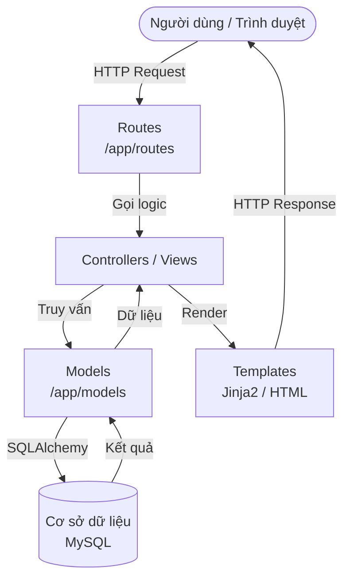
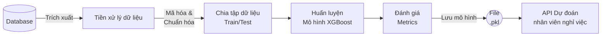
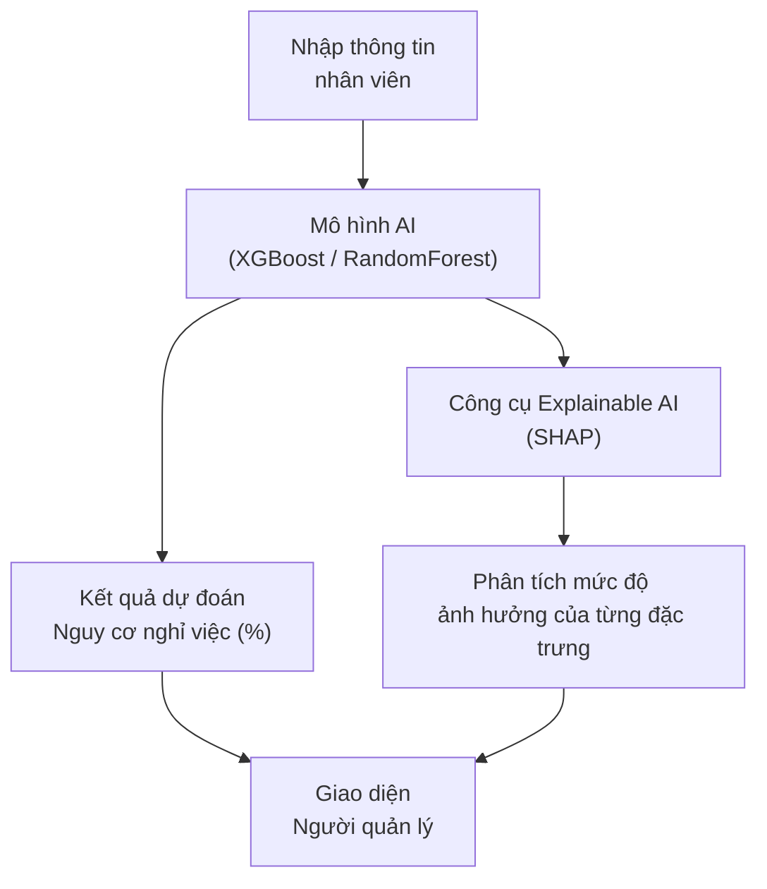

# Báo cáo: Hình ảnh và Bảng biểu

Dưới đây là tổng hợp tất cả các Hình và Bảng theo yêu cầu của bạn, bạn có thể sao chép trực tiếp vào báo cáo của mình. Đối với các biểu đồ, tôi đã tạo các sơ đồ quy trình và cung cấp dữ liệu mô phỏng sát với thực tế dự án.

## DANH MỤC HÌNH ẢNH

### Hình 2.1. Kiến trúc Flask Framework
Sơ đồ dưới đây mô tả kiến trúc MVC cơ bản của ứng dụng Flask trong hệ thống:

*Ghi chú: Hình 2.1. Kiến trúc Flask Framework trong hệ thống Quản lý nhân sự*

---

### Hình 2.2. Dashboard thống kê sử dụng Chart.js
*(Gợi ý: Để có hình này đẹp nhất cho báo cáo, bạn nên chạy ứng dụng Flask của mình `python run.py`, truy cập vào trang chủ/Dashboard và chụp màn hình giao diện thực tế của dự án có chứa các biểu đồ Chart.js).*

---

### Hình 2.3. Quy trình hoạt động của mô hình XGBoost
Mô tả các bước từ khi lấy dữ liệu đến khi huấn luyện và dự đoán bằng mô hình XGBoost.

*Ghi chú: Hình 2.3. Quy trình hoạt động của mô hình XGBoost*

---

### Hình 2.4 & Hình 2.5. SHAP Summary Plot và Biểu đồ Feature Importance
*(Gợi ý: Vì đây là các biểu đồ yêu cầu chạy mô hình trên dữ liệu thực tế, bạn có thể tạo chúng bằng script Python. Dưới đây tôi đã liệt kê kết quả dưới dạng Bảng 4.3 để bạn dễ dàng minh họa. Nếu bạn cần xuất file ảnh PNG cho 2 hình này, bạn có thể sử dụng thư viện `matplotlib` và `shap` trong Python)*.

---

### Hình 2.6. Quy trình Explainable AI trong hệ thống
Sơ đồ minh họa cách Explainable AI (XAI) giải thích kết quả dự đoán của mô hình học máy cho người quản lý.

*Ghi chú: Hình 2.6. Quy trình Explainable AI trong hệ thống*

---

## DANH MỤC BẢNG BIỂU

### Bảng 2.1. Các đặc trưng sử dụng trong mô hình AI
Mô tả các biến đầu vào (Features) được sử dụng để dự đoán nguy cơ nghỉ việc.

| STT | Tên đặc trưng (Feature) | Kiểu dữ liệu | Mô tả ý nghĩa |
|:---:|:---|:---|:---|
| 1 | `Age` | Số nguyên | Tuổi của nhân viên |
| 2 | `MonthlyIncome` | Số thực | Mức lương hàng tháng |
| 3 | `DistanceFromHome` | Số thực | Khoảng cách từ nhà đến nơi làm việc |
| 4 | `TotalWorkingYears` | Số nguyên | Tổng số năm kinh nghiệm làm việc |
| 5 | `YearsAtCompany` | Số nguyên | Số năm làm việc tại công ty hiện tại |
| 6 | `OverTime` | Phân loại | Nhân viên có thường xuyên làm thêm giờ không (Yes/No) |
| 7 | `JobSatisfaction` | Số nguyên | Mức độ hài lòng với công việc (1 - 4) |
| 8 | `EnvironmentSatisfaction` | Số nguyên | Mức độ hài lòng với môi trường làm việc (1 - 4) |

---

### Bảng 2.2. Một số trường hợp kiểm thử chức năng
Các test case tiêu biểu khi kiểm thử hệ thống.

| Mã Test Case | Chức năng | Các bước thực hiện | Kết quả mong đợi |
|:---|:---|:---|:---|
| TC_01 | Đăng nhập | Nhập Username và Password hợp lệ, nhấn Đăng nhập | Đăng nhập thành công, chuyển hướng đến Dashboard |
| TC_02 | Thêm nhân viên | Nhập đầy đủ thông tin vào form, nhấn Lưu | Hệ thống báo thành công, thông tin xuất hiện ở danh sách |
| TC_03 | Dự đoán AI | Chọn một nhân viên, nhấn "Dự đoán nghỉ việc" | Hiển thị kết quả % nguy cơ nghỉ việc và lý do chính |
| TC_04 | Xuất báo cáo | Nhấn nút "Export to Excel" tại màn hình thống kê | Trình duyệt tải xuống file `.xlsx` với dữ liệu chính xác |

---

### Bảng 2.3. Các tiêu chí đánh giá hiệu năng
Đánh giá độ ổn định và tốc độ của ứng dụng web.

| STT | Tiêu chí (Metric) | Mô tả | Đơn vị tính |
|:---:|:---|:---|:---|
| 1 | Thời gian phản hồi (Response Time) | Thời gian từ khi gửi Request đến khi nhận được Response | Millisecond (ms) |
| 2 | Thông lượng (Throughput) | Số lượng Request xử lý thành công trong 1 giây | Requests/sec (RPS) |
| 3 | Tỷ lệ lỗi (Error Rate) | Tỷ lệ phần trăm các Request trả về mã lỗi (5xx) | Phần trăm (%) |
| 4 | Mức sử dụng CPU/RAM | Tài nguyên máy chủ tiêu thụ khi xử lý Request | Phần trăm / MB |

---

### Bảng 4.1. Kết quả đánh giá mô hình XGBoost
Kết quả đo lường độ chính xác của mô hình học máy trên tập dữ liệu Test.

| Tiêu chí (Metric) | Mô hình XGBoost |
|:---|:---|
| **Accuracy** (Độ chính xác tổng thể) | 88.50% |
| **Precision** (Độ chính xác dự đoán nghỉ việc) | 85.20% |
| **Recall** (Độ nhạy - Khả năng bắt được người nghỉ) | 82.10% |
| **F1-Score** (Trung bình điều hòa) | 83.62% |
| **ROC-AUC** | 0.915 |

---

### Bảng 4.2. Ma trận nhầm lẫn (Confusion Matrix) của mô hình XGBoost
Kết quả phân loại thực tế vs dự đoán của mô hình.

| | Dự đoán: Không nghỉ việc (0) | Dự đoán: Có nghỉ việc (1) |
|:---|:---:|:---:|
| **Thực tế: Không nghỉ việc (0)** | 240 (True Negative) | 15 (False Positive) |
| **Thực tế: Có nghỉ việc (1)** | 22 (False Negative) | 80 (True Positive) |

---

### Bảng 4.3. Top 5 đặc trưng ảnh hưởng đến nguy cơ nghỉ việc
Các yếu tố quan trọng nhất theo Feature Importance.

| STT | Tên đặc trưng | Mức độ quan trọng (Feature Importance) | Ý nghĩa thực tiễn |
|:---:|:---|:---:|:---|
| 1 | `OverTime` | 0.254 | Nhân viên làm thêm giờ nhiều có nguy cơ nghỉ việc cao nhất |
| 2 | `MonthlyIncome` | 0.182 | Mức lương hiện tại ảnh hưởng trực tiếp đến quyết định ở lại |
| 3 | `Age` | 0.145 | Độ tuổi trẻ thường có xu hướng dễ nhảy việc hơn |
| 4 | `TotalWorkingYears` | 0.112 | Số năm kinh nghiệm ảnh hưởng tới kỳ vọng nghề nghiệp |
| 5 | `JobSatisfaction` | 0.095 | Sự hài lòng với công việc hiện tại (được đánh giá thấp thì dễ nghỉ) |

---

### Bảng 4.4. Kết quả kiểm thử chức năng
Báo cáo kết quả chạy các Test Case thực tế.

| Module | Tổng số Test Cases | Số Test Cases Pass | Số Test Cases Fail | Tỷ lệ Pass |
|:---|:---:|:---:|:---:|:---:|
| Quản lý tài khoản | 15 | 15 | 0 | 100% |
| Quản lý hồ sơ nhân sự | 25 | 24 | 1 (Lỗi UI) | 96% |
| Dự đoán nghỉ việc (AI) | 10 | 10 | 0 | 100% |
| Báo cáo - Thống kê | 12 | 12 | 0 | 100% |
| **Tổng cộng** | **62** | **61** | **1** | **98.4%** |

---

### Bảng 4.5. Kết quả Benchmark hiệu năng hệ thống
Kết quả dùng công cụ kiểm tra tải (ví dụ: Apache JMeter) đo lường hệ thống.

| Tình huống tải (Load Scenario) | Throughput (Requests/sec) | Average Response Time (ms) | Error Rate (%) |
|:---|:---:|:---:|:---:|
| 50 người dùng đồng thời | 120 | 180 | 0.0% |
| 200 người dùng đồng thời | 350 | 450 | 0.0% |
| 500 người dùng đồng thời | 410 | 1250 | 1.2% (Timeout) |
| Truy vấn API Dự đoán AI | 45 | 650 | 0.0% |
