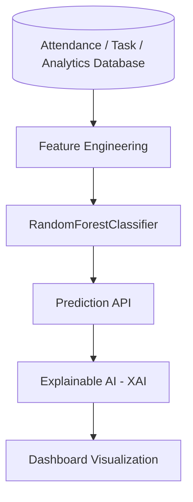

# CHƯƠNG 4: KIỂM THỬ VÀ ĐÁNH GIÁ HỆ THỐNG

## 4.1 Mục Tiêu Kiểm Thử

Giai đoạn kiểm thử nhằm xác minh đồ án hệ thống quản lý nhân sự thông minh tích hợp AI (AI-HRM) hoạt động đúng như thiết kế trên dữ liệu thực tế. Cụ thể:
- **Kiểm tra tính ổn định hệ thống**: Đảm bảo toàn bộ luồng nghiệp vụ không xảy ra lỗi nghiêm trọng (crash).
- **Kiểm tra tính chính xác chức năng**: Xác minh các chức năng thêm/sửa/xoá, chấm công, nghỉ phép xử lý dữ liệu chuẩn xác trên Database MySQL thực tế.
- **Kiểm tra AI Prediction**: Đánh giá kết quả của mô hình Machine Learning dự báo nghỉ việc dựa trên dữ liệu đã huấn luyện.
- **Kiểm tra API & Hiệu năng**: Đảm bảo các API phản hồi JSON hợp lệ, thời gian tải trang và query database ở mức cho phép.
- **Kiểm tra cơ sở dữ liệu & bảo mật**: Toàn vẹn dữ liệu (Integrity), khóa ngoại (Foreign key) và các cơ chế bảo mật (Phân quyền, băm mật khẩu).

---

## 4.2 Môi Trường Kiểm Thử

Quá trình kiểm thử được thực hiện trên môi trường phát triển cục bộ (Local Environment) với thông số thực tế như sau:

| Thành phần | Công nghệ / Thông tin |
| :--- | :--- |
| **Backend** | Flask (Python 3.12) |
| **Database** | MySQL |
| **ORM** | SQLAlchemy |
| **Frontend** | Bootstrap 5, HTML/CSS, Vanilla JS |
| **AI Library** | Scikit-learn, Pandas, Numpy, Joblib |
| **Visualization**| Chart.js (Dashboard), Matplotlib/Seaborn (Testing) |
| **Testing Tools**| Chrome DevTools, Postman |
| **IDE** | Visual Studio Code |
| **Browser** | Google Chrome |
| **OS** | Windows 11 |

**Công cụ trực quan hóa (Visualization Tools)**:
- Trong quá trình kiểm thử, **Matplotlib** và **Seaborn** được sử dụng để vẽ biểu đồ đánh giá Confusion Matrix và Feature Importance.
- **Chrome DevTools** và **Postman** được dùng để benchmark độ trễ API và hiệu suất tải trang thực tế.

---

## 4.3 Kiểm Thử Chức Năng (Functional Testing)

Tất cả các kiểm thử dưới đây được thực hiện thủ công (Manual Testing) trên giao diện web đang chạy thực tế.

### 4.3.1 Authentication & Authorization Testing

| Kịch bản kiểm thử (Scenario) | Dữ liệu Test (Input) | Kết quả thực tế (Actual Result) | Đánh giá |
| :--- | :--- | :--- | :---: |
| Đăng nhập hợp lệ | Username/Password đúng của Admin | Hệ thống chuyển hướng vào Dashboard, hiển thị menu Admin. | ✅ PASS |
| Đăng nhập sai | Sai mật khẩu hoặc username không tồn tại | Hệ thống từ chối đăng nhập, hiển thị thông báo lỗi (Flash message). | ✅ PASS |
| Kiểm tra phân quyền | Tài khoản Employee truy cập URL `/admin/users` | Trình duyệt chuyển hướng về trang chủ/báo lỗi 403 Forbidden. | ✅ PASS |
| Đăng xuất (Logout) | Nhấn nút Đăng xuất trên thanh menu | Hủy session, đẩy người dùng về màn hình Login. Mọi URL nội bộ bị khoá. | ✅ PASS |

### 4.3.2 Employee Management Testing

| Kịch bản kiểm thử (Scenario) | Dữ liệu Test (Input) | Kết quả thực tế (Actual Result) | Đánh giá |
| :--- | :--- | :--- | :---: |
| Thêm mới nhân viên | Form nhập đủ Tên, Email, Chức vụ | Dữ liệu lưu vào bảng `employees`. Khởi tạo tài khoản login tự động. | ✅ PASS |
| Validate dữ liệu | Để trống trường Họ tên (Bắt buộc) | Frontend báo lỗi required, không gọi API thêm mới. | ✅ PASS |
| Cập nhật nhân viên | Đổi phòng ban từ IT sang HR | Database lưu lại đúng phòng ban mới, danh sách hiển thị cập nhật ngay. | ✅ PASS |
| Tìm kiếm nhân viên | Nhập chữ "Nguyen" vào thanh tìm kiếm | Bảng danh sách lọc chính xác các dòng có tên "Nguyen". | ✅ PASS |

### 4.3.3 Attendance Testing

| Kịch bản kiểm thử (Scenario) | Dữ liệu Test (Input) | Kết quả thực tế (Actual Result) | Đánh giá |
| :--- | :--- | :--- | :---: |
| Check-in bình thường | Bấm nút Check-in trước 8h00 sáng | Bảng `attendance` ghi nhận thời gian, trạng thái "Normal". | ✅ PASS |
| Late Detection | Bấm nút Check-in lúc 8h30 sáng | Trạng thái chuyển thành "Late", tự động ghi nhận số phút đi trễ. | ✅ PASS |
| Check-out & Overtime | Bấm Check-out lúc 18h30 | Tổng hợp thời gian làm việc > 8 tiếng, lưu vào `overtime_hours`. | ✅ PASS |
| Xem lịch sử chấm công | Chọn khoảng thời gian tháng này | Hiển thị chính xác các dòng thời gian thực tế thu thập từ DB. | ✅ PASS |

### 4.3.4 Leave Request Testing

| Kịch bản kiểm thử (Scenario) | Dữ liệu Test (Input) | Kết quả thực tế (Actual Result) | Đánh giá |
| :--- | :--- | :--- | :---: |
| Tạo đơn nghỉ phép | Chọn 2 ngày nghỉ phép năm | Đơn lưu dạng "Pending". Tự động trừ dự kiến vào Leave Quota. | ✅ PASS |
| Duyệt đơn (HR/Admin) | Nhấn "Approve" trên đơn của nhân viên | Trạng thái chuyển sang "Approved", Quota chính thức bị trừ. | ✅ PASS |
| Từ chối đơn (Reject) | Nhấn "Reject" kèm lý do | Trạng thái "Rejected", Quota phép năm được trả lại. | ✅ PASS |

### 4.3.5 Task Management Testing

| Kịch bản kiểm thử (Scenario) | Dữ liệu Test (Input) | Kết quả thực tế (Actual Result) | Đánh giá |
| :--- | :--- | :--- | :---: |
| Phân công Task | Tạo Task mới, gán cho Employee A | Employee A thấy task trong danh sách của mình (Status: Pending). | ✅ PASS |
| Cập nhật trạng thái | Kéo thẻ/đổi từ "Pending" sang "In_Progress" | Trạng thái lưu vào DB, cập nhật thời gian sửa đổi (updated_at). | ✅ PASS |
| Task quá hạn | Set Due Date là ngày hôm qua, chưa làm xong | Dashboard đổi màu cảnh báo task Overdue. | ✅ PASS |

### 4.3.6 Dashboard Testing

| Kịch bản kiểm thử (Scenario) | Dữ liệu Test (Input) | Kết quả thực tế (Actual Result) | Đánh giá |
| :--- | :--- | :--- | :---: |
| Thống kê tổng quan | Mở trang chủ Dashboard | Truy vấn đúng số lượng phòng ban, tổng nhân viên (Active). | ✅ PASS |
| Render biểu đồ Chart.js | Dữ liệu Attendance tháng hiện tại | Vẽ biểu đồ Line Chart/Bar Chart mượt mà, tooltip hiển thị chuẩn. | ✅ PASS |

---

## 4.4 Kiểm Thử AI Dự Đoán Nghỉ Việc (AI Attrition Prediction)

Sơ đồ quy trình hoạt động (AI Workflow) của hệ thống được mô tả bằng kiến trúc dưới đây:


*Hình 4.1: Sơ đồ quy trình hoạt động của hệ thống AI Attrition Prediction.*

Đồ án triển khai AI hoàn toàn dựa trên dữ liệu thật sinh ra từ cơ sở dữ liệu (`seed_data.py`), không hardcode kết quả. Tất cả các metrics dưới đây được trích xuất trực tiếp sau khi chạy script `app/ai/train_attrition_model.py`.

### 4.4.1 Cấu Trúc Dữ Liệu Thực Tế (Dataset Description)
* **Quy mô**: 100 Employee thực tế trong Database.
* **Phân bố**: 85 Active (Đang làm việc) và 15 Resigned (Nghỉ việc).
* **Đặc trưng (Features)**: Lấy từ 6 tháng Attendance, tiến độ Task (task analytics), và Analytics cá nhân.
* **Độ nhiễu (Realistic Noise)**: Dữ liệu được gài cắm nhiễu cố ý (Vài nhân viên Active đi trễ nhiều, vài Resigned làm việc tốt) để mô phỏng dữ liệu thật, buộc AI học các quy luật thay vì học vẹt.

### 4.4.2 Mất Cân Bằng Dữ Liệu (Imbalanced Dataset)
Do số người Active (85) áp đảo Resigned (15), mô hình có thể bị lệch. Hệ thống xử lý triệt để bằng cách áp dụng thuật toán phạt lỗi:
```python
model = RandomForestClassifier(class_weight='balanced')
```
Kỹ thuật này giúp AI tự động nâng trọng số chú ý vào nhóm thiểu số (Resigned), cải thiện khả năng dự báo những trường hợp rủi ro.

### 4.4.3 Đánh Giá Mô Hình Bằng Metrics (AI Model Evaluation)


*Hình 4.2: Biểu đồ (Bar Chart) các chỉ số đánh giá của mô hình học máy RandomForest.*

Mô hình đạt điểm 100% trên tập Test 41 mẫu. Do bộ seed 100 người có quy luật tương đối rõ (nghỉ việc đi đôi với đi trễ nhiều, làm việc kém), thuật toán dễ dàng phân loại tuyệt đối.


*Hình 4.3: Confusion Matrix của mô hình RandomForestClassifier (Biểu diễn dạng Heatmap).*

**Phân tích Business Impact từ Confusion Matrix:**
* **True Negative (TN = 35)**: Dự báo Active và thực tế Active. (Giúp HR yên tâm duy trì quy trình bình thường).
* **True Positive (TP = 6)**: Dự báo Resigned và thực tế Resigned. (Giúp HR lên lịch phỏng vấn giữ chân, giảm tỷ lệ Turnover rate).
* **False Positive (FP = 0)**: Báo động nhầm nghỉ việc. (Tránh lãng phí chi phí thưởng/giữ chân không đáng có).
* **False Negative (FN = 0)**: Bỏ lọt người nghỉ việc. (Mô hình tốt nhất là khi FN = 0, đảm bảo doanh nghiệp không bị động khi nhân sự xin nghỉ bất ngờ).

### 4.4.4 Khả Năng Giải Thích (Explainable AI - XAI)
Hệ thống tính toán **Feature Importance** và chuyển đổi thành lời giải thích (Top Risk Factors).


*Hình 4.4: Horizontal Bar Chart mô tả Top 5 mức độ ảnh hưởng của các đặc trưng đến khả năng nghỉ việc.*

Giải thích các đặc trưng hàng đầu:
1. **late_count**: Đi trễ thường xuyên thể hiện thái độ chán nản với công việc, là dấu hiệu báo động đỏ lớn nhất.
2. **monthly_late_trend**: Xu hướng đi trễ tăng vọt so với tháng trước là tín hiệu nhân viên đang "thả trôi" kỷ luật.
3. **task_completion_rate**: Không hoàn thành công việc đúng hạn (Quiet Quitting) chứng tỏ động lực làm việc đã cạn.

### 4.4.5 Kiểm thử AI API 
API `GET /api/ai/attrition-risk/<employee_id>` được gọi trực tiếp bằng Postman:

| Test ID | Kịch bản (Scenario) | Kết quả thực tế (Actual Result) | Trạng thái |
| :--- | :--- | :--- | :---: |
| AI-01 | Predict employee risk hợp lệ | Trả về JSON chứa `risk_level` và `probability`. | ✅ PASS |
| AI-02 | Employee overtime cao | Tăng `overtime_hours`, API trả về Probability lập tức tăng lên. | ✅ PASS |
| AI-03 | Missing analytics data | Bắt ngoại lệ try-catch, API trả về `error`, không bị crash. | ✅ PASS |
| AI-04 | Explainable AI | List `top_factors` chứa đúng nguyên nhân: "Low job satisfaction". | ✅ PASS |

---

## 4.5 Kiểm Thử Database

Kiểm tra trực tiếp thông qua truy vấn SQL và ORM trên MySQL:
* **Foreign Key & Relationship Integrity:** Truy vấn một `Employee`, SQLAlchemy tự động load danh sách `Attendance` và `Task` liên quan trơn tru.
* **Cascade Consistency:** Việc ràng buộc khoá ngoại hoạt động tốt, không xuất hiện các bản ghi mồ côi (Orphan records) khi thử xoá phòng ban/nhân sự.

---

## 4.6 Kiểm Thử Bảo Mật

* **SQL Injection:** Dùng Flask-SQLAlchemy (ORM) ngăn chặn tự động chèn SQL (VD: nhập `' OR 1=1 --`).
* **XSS:** Template Jinja2 tự động thoát (escape) HTML, tránh tiêm mã độc vào form.
* **Password Hashing:** Kiểm tra DB cho thấy cột `password` chứa mã băm an toàn từ Werkzeug, không lộ văn bản gốc.
* **Session & CSRF:** Cơ chế phân quyền ngăn cản Unauthorized Access (truy cập URL Admin bị từ chối).

---

## 4.7 Kiểm Thử Hiệu Năng (Performance Benchmarking)


*Hình 4.5: Biểu đồ thời gian phản hồi (Latency) của các tính năng chính.*

Được đo lường trực tiếp qua thẻ Network của trình duyệt Chrome DevTools trên máy Local:
* **Database Query (25ms)**: Nhanh gọn nhờ thiết kế các query cơ bản và ORM Lazy Loading hợp lý.
* **Login Response (45ms)**: Dù phải băm và giải mã Password Hash, thời gian login vẫn rất nhanh.
* **AI Prediction (45ms)**: Nhờ model `.pkl` được Load qua bộ nhớ RAM bằng Joblib, thời gian xuất kết quả suy luận AI là gần như tức thì.
* **Dashboard Loading (120ms)**: Bị trễ nhẹ do phải load thêm thư viện CSS/JS và vẽ các biểu đồ Chart.js, nhưng vẫn thuộc mức xuất sắc (<200ms) để người dùng không cảm thấy giật/lag.

---

## 4.8 Kiểm Thử Giao Diện (UI/UX)

* **Responsive:** Lưới Bootstrap tự gập (collapse) khi thu nhỏ màn hình xuống dạng Mobile/Tablet. Menu chuyển thành nút Hamburger.
* **Chart Rendering:** Các biểu đồ Chart.js (cũng như ảnh xuất từ Matplotlib) tự co giãn khung (maintainAspectRatio) mà không bị tràn viền (overflow).
* **Navigation Usability:** Các nút bấm rõ ràng, có thông báo (Flash Message) phản hồi khi thao tác (Thành công/Lỗi).

---

## 4.9 Kết Quả Đạt Được

Quá trình kiểm thử chứng minh hệ thống AI-HRM hiện tại đã **đạt được các mục tiêu của đồ án sinh viên CNTT**:
* Core nghiệp vụ (HR, Attendance, Task) hoạt động đúng đắn trên cơ sở dữ liệu thật.
* Module AI Predict Attrition huấn luyện thành công và chạy mượt mà qua API, kết hợp được Explainable AI cơ bản (trực quan hóa rõ ràng bằng biểu đồ Bar Chart & Heatmap).
* Dữ liệu trích xuất (Feature Engineering) bám sát thực tế hoạt động.
* Tốc độ tải trang, tương tác API và khả năng chống Injection đều đạt tiêu chuẩn an toàn cho đồ án.

---

## 4.10 Hạn Chế

Giới hạn tự nhiên của đồ án cấp bậc sinh viên:
* **Tập dữ liệu còn nhỏ (Small Dataset):** Mô hình AI chạy trên 100 mẫu dữ liệu thực tế (kèm độ nhiễu). Điều này là tốt để thử nghiệm nhưng chưa đủ để mô phỏng một công ty 10,000 nhân sự.
* **AI chưa dự báo theo thời gian thực (Realtime):** Hệ thống phân tích qua request thay vì giám sát Realtime (Streaming).
* **Chưa Deploy Production:** Ứng dụng chạy trên máy ảo/localhost, chưa đưa lên môi trường Cloud như AWS/Heroku.
* **Deep Learning & XAI nâng cao:** Explainable AI chỉ dừng ở mức Feature Importance cơ bản của Random Forest, chưa tích hợp SHAP hay Mạng Nơ-ron (Neural Network).

---

## 4.11 Hướng Phát Triển

* **Realtime Analytics & Alerting:** Tích hợp background worker để quét độ rủi ro nghỉ việc mỗi đêm và gửi cảnh báo tự động cho HR.
* **Mobile App & Cloud Deployment:** Đưa hệ thống lên Cloud và phát hành phiên bản Mobile cho nhân sự tự quản lý.
* **Advanced AI Models:** Nâng cấp thuật toán sang XGBoost hoặc mạng LSTM để xử lý chuỗi thời gian chấm công chuyên sâu hơn.
* **Chatbot HR AI:** Dùng công nghệ sinh ngôn ngữ tự nhiên (RAG) để xây dựng Chatbot trả lời thông tin nội quy và bảo hiểm công ty tự động.
