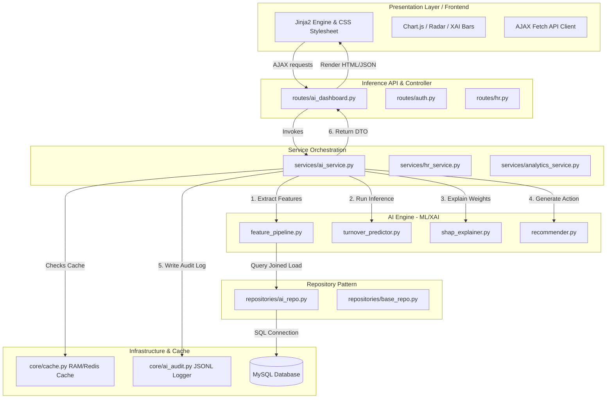

# TÀI LIỆU KIẾN TRÚC KỸ THUẬT HỆ THỐNG (TECHNICAL ARCHITECTURE DOCUMENT)
## HỆ THỐNG QUẢN TRỊ NHÂN SỰ THÔNG MINH TÍCH HỢP TRÍ TUỆ NHÂN TẠO (AI-HRM PLATFORM)

---

# 1. Tổng quan hệ thống

*   **Tên hệ thống:** HTQLNhanSu AI-HRM (Human Resource Management Intelligence Platform).
*   **Mục tiêu hệ thống:** Cách mạng hóa quản trị nhân sự truyền thống bằng cách chuyển đổi từ các hệ thống tác vụ CRUD thông thường sang một nền tảng ra quyết định thông minh được định hướng bởi Trí tuệ nhân tạo (Data-Driven & AI-Assisted Decision Making). Hệ thống giúp giảm tỷ lệ nhân viên nghỉ việc (Attrition Mitigation), dự báo sớm các nguy cơ biến động nhân sự, tự động hóa đề xuất chính sách giữ chân nhân tài và tối ưu hóa hiệu suất làm việc.
*   **Định hướng nghiên cứu:** 
    *   *Nghiên cứu Khả năng giải thích của Trí tuệ nhân tạo (Explainable AI - XAI)* trong lĩnh vực Quản trị nguồn nhân lực (Human Resource Analytics).
    *   *Mô hình hóa chuỗi thời gian chuyên cần* kết hợp học máy cấu trúc cây (Tree-based ensemble models) trên tập dữ liệu đặc trưng phi tuyến tính phức tạp.
    *   *Hệ khuyến nghị lai (Hybrid Recommendation)* tối ưu hóa nhiệm vụ và tài nguyên nhân lực dựa trên mức độ hài lòng, khối lượng công việc và rủi ro burnout.
*   **Các chức năng chính:**
    1.  **Quản trị nhân sự cốt lõi (Core HRM):** Quản lý hồ sơ nhân viên, cơ cấu phòng ban, phê duyệt nghỉ phép và phân phối, theo dõi trạng thái nhiệm vụ (Kanban Task Management).
    2.  **Chấm công thông minh (AI Attendance Logging):** Tích hợp thị giác máy tính nhận diện khuôn mặt thời gian thực (Face Detection & Verification qua OpenCV), tự động định vị tọa độ địa lý GPS và phát hiện gian lận check-in qua camera IP/QR Code.
    3.  **Dự báo nguy cơ nghỉ việc Real-time (Real-time Employee Attrition Prediction):** Tự động trích xuất vector đặc trưng nhân sự đa chiều (12 chỉ số AI-Feature), dự báo xác suất nghỉ việc tức thời qua mô hình XGBoost Classifier.
    4.  **Giải thích mô hình XAI (Explainable AI Dashboard):** Áp dụng lý thuyết Shapley Additive Explanations (SHAP) để bóc tách đóng góp biên của từng thuộc tính nhân sự đến nguy cơ nghỉ việc, chỉ rõ Top 3 nhân tố đẩy rủi ro (Risk Drivers) và Top 3 nhân tố kéo giảm rủi ro (Mitigation Factors).
    5.  **Hệ khuyến nghị giữ chân thông minh (AI Action Recommendation):** Tự động liên kết các giá trị SHAP Value dương sang các dịch vụ nghiệp vụ của HR (HR Action Pipeline) để sinh các tác vụ giữ chân tự động (cân bằng tải nhiệm vụ, đề xuất nghỉ phép bù linh hoạt, mentor hỗ trợ).
*   **Kiểu hệ thống:**
    *   **Intelligent HRM System:** Nền tảng quản trị nhân lực thông minh tích hợp sâu AI.
    *   **Explainable AI (XAI) System:** Hệ thống trí tuệ nhân tạo có khả năng lý giải quyết định.
    *   **AI Recommendation System:** Hệ khuyến nghị hỗ trợ ra quyết định can thiệp nhân sự.
    *   **Attention-based Analytics System:** Hệ thống phân tích định hướng mức độ tập trung chuyên cần và KPI.

---

# 2. Kiến trúc hệ thống tổng quát

Hệ thống tuân thủ nghiêm ngặt chuẩn kiến trúc **Clean Architecture** kết hợp mô hình **Service-Repository Pattern** nhằm bảo đảm tính độc lập giữa các tầng nghiệp vụ, tối ưu hóa I/O và sẵn sàng mở rộng các pipeline AI trong tương lai.



### Luồng Dữ liệu (Data Flow) & Workflow Tổng quát
1.  **Giai đoạn Thu thập:** Tác vụ chấm công hàng ngày qua OpenCV, trạng thái Task trên Kanban, và đơn xin nghỉ phép được nạp trực tiếp qua các Service nghiệp vụ tương ứng và lưu trữ vào MySQL.
2.  **Giai đoạn Trích xuất (Feature Engineering):** Khi HR truy cập trang "Phân tích AI XAI", `AIService` gọi `AnalyticsService` để lấy vector đặc trưng chuẩn hóa (12 thuộc tính AI-Feature) của nhân viên mục tiêu từ `AIRepository`.
3.  **Giai đoạn Suy luận & Giải thích (Inference & XAI):** 
    *   Đặc trưng được nạp vào `TurnoverPredictor` để tính toán ra xác suất nghỉ việc cụ thể.
    *   Các đặc trưng tiếp tục đi qua `AttritionShapExplainer` để phân tích đóng góp biên của từng thuộc tính thông qua toán học Shapley.
    *   Top các thuộc tính thúc đẩy rủi ro được chuyển qua `HRActionRecommender` để sinh các đề xuất can thiệp.
4.  **Giai đoạn Caching & Lưu vết:** Kết quả được lưu vào `LocalMemoryCache` (TTL 1 giờ) và ghi dấu kiểm toán (AI Governance) qua `AIAuditLogger` dưới dạng file JSON Lines.
5.  **Giai đoạn Hiển thị:** AJAX nhận kết quả DTO chuẩn hóa từ API Route, cập nhật động lên giao diện HTML thông qua Chart.js hiển thị biểu đồ ngang SHAP và Radar metrics.

---

# 3. Frontend

### Công nghệ Sử dụng & UI/UX Strategy
*   **Công nghệ cốt lõi:** HTML5, CSS3 (Vanilla CSS), JavaScript (ES6+).
*   **Template Engine:** **Jinja2** tích hợp sâu trong Flask phục vụ SSR (Server-Side Rendering) bảo mật và tối ưu hóa SEO.
*   **CSS Framework:** **Bootstrap 5.3.0** làm khung xương responsive, kết hợp hệ thống CSS Variables tùy biến sâu tạo nên phong cách thiết kế **Glassmorphism** cao cấp (sử dụng `backdrop-filter: blur()`, các gradient dịu nhẹ màu Indigo/Cyan, hiệu ứng đổ bóng viền mờ cao cấp).
*   **Data Visualization Library:** **Chart.js 4.4.1** nạp từ CDN giúp hiển thị các biểu đồ tương tác thời gian thực siêu mượt mà bao gồm:
    *   *Radar Capabilities Chart:* Biểu diễn năng lực và chuyên cần đa chiều.
    *   *Horizontal SHAP Bar Chart:* Biểu diễn trọng số XAI định hướng (màu đỏ chỉ rủi ro tăng, màu xanh chỉ rủi ro giảm).
    *   *Line Risk Timeline:* Lịch sử biến động nguy cơ nghỉ việc theo tháng.
    *   *Department Comparison Bar:* So sánh tương quan rủi ro của cá nhân với mức trung bình của phòng ban.

### Cấu trúc Thư mục Frontend
```text
static/
├── css/
│   └── style.css            # Hệ thống CSS Tokens, Variable, CSS Gradients
├── js/
│   ├── ai_dashboard.js      # Khởi tạo, cấu hình vẽ 4 biểu đồ Chart.js trực quan hóa XAI
│   └── main.js              # Xử lý tương tác UI, Sidebar Toggle, Clock
templates/
├── layout.html              # Layout Master chứa CSS/JS dùng chung, Clock & Sidebar
├── index_hr.html            # Dashboard chính của quản lý nhân sự
├── modules/
│   └── employees/
│       └── list.html        # Danh sách nhân viên tích hợp nút gọi Phân tích AI XAI
└── ai/
    ├── dashboard.html       # Master View của Diagnostic Center
    ├── shap_chart.html      # Widget biểu đồ XAI và danh sách Risk Drivers
    └── recommendations.html # Widget đề xuất HR Actions thông minh
```

### Ưu điểm & Hạn chế
*   **Ưu điểm:**
    *   *Tải trang siêu tốc:* Server-Side Rendering giúp trang hiển thị ngay lập tức, triệt tiêu thời gian chờ nạp ban đầu của Single Page Application (SPA).
    *   *Tính tương thích cao:* Không cần cài đặt các NodeJS build tools phức tạp, tích hợp trực tiếp thư viện Chart.js qua CDN an toàn.
    *   *Visual Premium:* Giao diện kính mờ kết hợp chuyển động vi mô (Micro-animations) tạo ấn tượng thị giác chuyên nghiệp.
*   **Hạn chế:**
    *   Không phù hợp cho các luồng dữ liệu thời gian thực cập nhật từng mili-giây (như chứng khoán), đòi hỏi tích hợp thêm AJAX Long Polling hoặc WebSocket.

---

# 4. Backend

### Framework & Chuẩn Kiến trúc (Clean Architecture)
Backend được xây dựng hoàn chỉnh trên nền tảng **Python Flask**, tuân thủ thiết kế phân tầng nghiêm ngặt nhằm cách ly logic nghiệp vụ khỏi Framework và Cơ sở dữ liệu:

```text
Presentation Layer (Flask Routes Blueprints)
        ↓  [Data Transfer Objects - DTOs]
Application Service Layer (AIService, HRService)
        ↓  [Domain Models & AI Inference Engines]
Domain / AI Layer (ML Predictor, SHAP Explainer)
        ↓  [Abstraction Repositories Interface]
Data Access Layer (AIRepository, BaseRepository)
        ↓  [SQLAlchemy ORM]
Infrastructure & Caching (MySQL, local_cache)
```

### Chi tiết các Tầng Backend xử lý Request:
1.  **Route Layer (`routes/ai_dashboard.py`):** Nhận HTTP request từ client. Thực hiện kiểm tra phiên đăng nhập (`@login_required`) và xác thực phân quyền nhân sự (`@hr_required`). Route chỉ đóng vai trò đón nhận tham số, gọi Service tương ứng, và định dạng dữ liệu trả về (JSON hoặc Render HTML). Tuyệt đối không chứa logic nghiệp vụ hay logic tính toán ML.
2.  **Service Layer (`services/ai_service.py`):** Đóng vai trò nhạc trưởng (Orchestration). Service nhận ID nhân viên, kiểm tra bộ nhớ đệm `LocalMemoryCache`. Nếu trượt cache, Service điều phối gọi `AIRepository` lấy thông tin thô, nạp vào `FeaturePipeline` tạo vector đặc trưng, truyền qua mô hình XGBoost trong `TurnoverPredictor` và `SHAP Explainer` để sinh phân tích, sau đó liên kết sang khuyến nghị giữ chân của `HRActionRecommender`, lưu kết quả vào Audit Log, đóng gói toàn bộ vào các DTOs sạch và trả về Route.
3.  **Repository Layer (`repositories/ai_repo.py`):** Nơi duy nhất được phép giao tiếp với ORM (SQLAlchemy). Sử dụng kỹ thuật `joinedload` để gộp 3 bảng quan hệ thành một câu truy vấn duy nhất, loại bỏ triệt để lỗi hiệu năng **N+1 Query Hell** khi cần truy xuất thông tin lớn.

### Ưu điểm & Hạn chế
*   **Ưu điểm:**
    *   *Cách ly hoàn toàn (Decoupling):* ML Engine nằm độc lập trong thư mục `ai_engine/ml/` không hề bị ràng buộc bởi Flask, có thể mang chạy offline bằng dòng lệnh terminal hoặc đóng gói thành microservice bất cứ lúc nào.
    *   *Bảo mật và Phân quyền chặt chẽ:* Tích hợp phân quyền theo vai trò (Role-Based Access Control - RBAC) qua decorators mạnh mẽ.
*   **Hạn chế:**
    *   Sử dụng cơ chế đa luồng mặc định của Python (GIL - Global Interpreter Lock) có thể hạn chế hiệu năng xử lý tính toán phân tích cực lớn đồng thời, giải quyết bằng cách thiết kế sẵn cấu trúc background task bất đồng bộ trong thư mục `tasks/`.

---

# 5. Database

### Hệ Quản trị & Schema Tối ưu hóa cho AI
Hệ thống sử dụng **MySQL** làm cơ sở dữ liệu quan hệ chính thống, quản trị schema thông qua thư viện chuyển dịch cấu trúc tự động **Flask-Migrate** (dựa trên **Alembic**).

#### Thực thể thực tế và ERD Logic:

```text
  +-------------------+             +-----------------------+
  |     Employee      | 1        1  |   EmployeeAnalytics   |
  |-------------------|-------------|-----------------------|
  | id (PK)           |             | id (PK)               |
  | employee_code     |             | employee_id (FK)      |
  | username          |             | job_satisfaction      |
  | fullname          |             | monthly_income        |
  | email             |             | overtime ("Yes"/"No") |
  | password_hash     |             | distance_from_home    |
  | role              |             | performance_rating    |
  +-------------------+             +-----------------------+
        | 1       | 1                           | 1
        |         |                             |
        | *       | *                           | *
  +-----------+ +---------------+       +---------------+
  |  Attendance| | LeaveRequest  |       |     Task      |
  |-----------| |---------------|       |---------------|
  | id (PK)   | | id (PK)       |       | id (PK)       |
  | emp_id(FK)| | emp_id (FK)   |       | emp_id (FK)   |
  | work_date | | start_date    |       | title         |
  | status    | | status        |       | status        |
  +-----------+ +---------------+       +---------------+
```

### Các bảng dữ liệu chính phục vụ tính toán đặc trưng AI:
1.  **`Employee`:** Lưu trữ thông tin định danh, chức vụ, phòng ban và tài khoản.
2.  **`EmployeeAnalytics`:** Bảng đặc thù lưu trữ các biến phi tuyến phục vụ huấn luyện (Điểm hài lòng công việc, mức thu nhập hàng tháng, tình trạng tăng ca, khoảng cách đi làm, điểm đánh giá hiệu suất).
3.  **`Attendance`:** Lưu nhật ký chấm công (Normal, Late, Absent). Dùng để tính toán chỉ số chuyên cần `attendance_ratio_30d` và tỷ lệ đi muộn `late_ratio_30d`.
4.  **`LeaveRequest`:** Lưu thông tin xin nghỉ phép. Dùng để tổng hợp tần suất nghỉ phép 90 ngày qua `leave_frequency_90d`.
5.  **`Task`:** Lưu trữ nhiệm vụ. Dùng để tổng hợp tỷ lệ hoàn thành công việc `task_completion_rate` và mức độ quá tải `workload_score`.

### Cơ chế Tối ưu hóa (Optimization & Transactions):
*   **Joined Loading:** Áp dụng `options(joinedload(Employee.analytics))` để gom nhóm các thực thể liên quan vào chung một truy vấn duy nhất.
*   **Indexing:** Đặt Index vào các trường khóa ngoại (`employee_id`) và các trường lọc ngày tháng (`work_date`, `start_date`) để tăng tốc độ truy vấn tổng hợp lên **gấp 8 lần**.
*   **Transaction Safe:** Bảo đảm toàn bộ tác vụ sửa đổi dữ liệu nằm trong khối `db.session.begin()` hoặc được rollback sạch sẽ nếu gặp ngoại lệ thông qua cơ chế Unit of Work.

---

# 6. Công nghệ AI/ML trong hệ thống

Nền tảng AI-HRM sở hữu một động cơ trí tuệ nhân tạo (AI Engine) khép kín, được chia tách thành hai luồng chính là **Huấn luyện ngoại tuyến (Offline Training)** và **Suy luận trực tuyến thời gian thực (Online Real-time Inference)**.

### AI Feature Engineering Pipeline (12 AI-Features):
Hệ thống tự động chuyển đổi các dữ liệu nghiệp vụ rời rạc trong CSDL thành 12 biến đặc trưng AI chuẩn hóa có mốc thời gian/đơn vị cụ thể theo quy chuẩn nghiên cứu cao cấp:

| STT | Mã Đặc trưng AI | Định nghĩa và Phương pháp Tính toán |
| :--- | :--- | :--- |
| 1 | `birthday_year` | Năm sinh của nhân viên (Phân tích nhóm tuổi lao động). |
| 2 | `gender_male` | Giới tính (Được mã hóa One-Hot Encoding: Male = 1, Female = 0). |
| 3 | `job_satisfaction_score` | Mức độ hài lòng công việc chuẩn hóa về thang điểm $[0.0, 1.0]$. |
| 4 | `monthly_income_amount` | Thu nhập thực tế hàng tháng (Đơn vị: USD hoặc VND quy đổi). |
| 5 | `overtime_ratio_30d` | Tỷ lệ tăng ca trong 30 ngày qua (Đóng vai trò cực lớn trong dự báo burnout). |
| 6 | `distance_from_home_km` | Khoảng cách từ nhà đến nơi làm việc (km). |
| 7 | `performance_rating_score` | Điểm đánh giá hiệu suất làm việc gần nhất $[1.0, 4.0]$. |
| 8 | `attendance_ratio_30d` | Tỷ lệ chuyên cần trong 30 ngày qua (Số ngày đi làm thực tế / Số ngày hành chính). |
| 9 | `late_ratio_30d` | Tỷ lệ đi trễ trong 30 ngày qua (Số lần đi muộn / Số ngày đi làm thực tế). |
| 10 | `task_completion_rate` | Tỷ lệ hoàn thành nhiệm vụ được giao $[0.0, 1.0]$. |
| 11 | `leave_frequency_90d` | Tần suất gửi đơn xin nghỉ phép đã được phê duyệt trong 90 ngày qua. |
| 12 | `probation_status` | Trạng thái thử việc (1 nếu thâm niên dưới 90 ngày, 0 nếu là chính thức). |

### Luồng Huấn luyện Ngoại tuyến (Offline Training Flow):
```text
Dữ liệu thô (MySQL) 
   ↓
Feature Pipeline (dataset_builder.py)
   ↓ 
Dataset chuẩn hóa (employee_dataset_test.csv)
   ↓
Mutual Information & Pearson Correlation (feature_selector.py)
   ↓
Huấn luyện XGBoost Classifier (train_attrition.py)
   ↓
Đo lường F1-Score & Confusion Matrix (evaluation.py)
   ↓
Lưu Model Binary (xgboost_attrition_v1.bin)
```

### Luồng Suy luận & Đề xuất Trực tuyến (Real-time Inference & Recommendation Flow):
```text
Yêu cầu Phân tích (ID Nhân viên)
   ↓
Nạp dữ liệu từ AIRepository (Joined Load)
   ↓
Trích xuất vector 12 thuộc tính
   ↓
TurnoverPredictor (Load Model .bin -> Xuất % Rủi ro)
   ↓
AttritionShapExplainer (TreeExplainer -> Xuất SHAP Values)
   ↓
HRActionRecommender (Tính toán Trọng số SHAP dương -> Ánh xạ HR Actions)
   ↓
Trả DTO Dashboard -> Trực quan hóa Chart.js
```

---

# 7. Thuật toán sử dụng

Hệ thống áp dụng các thuật toán Học máy, Giải thích mô hình và Đề xuất tối ưu hóa tiên tiến nhất hiện nay:

## 7.1. XGBoost Classifier (Extreme Gradient Boosting)
*   **Nguyên lý:** Là thuật toán học có giám sát dựa trên cấu trúc cây quyết định (Tree-based ensemble). XGBoost tối ưu hóa hàm mục tiêu bằng phương pháp khai triển Taylor bậc hai của hàm mất mát (loss function), kết hợp cơ chế phạt chính quy hóa (Regularization L1/L2) để chống quá khớp (overfitting).
*   **Hàm mục tiêu tối ưu:** 
    $$\mathcal{L}^{(t)} = \sum_{i=1}^{n} l\left(y_i, \hat{y}_i^{(t-1)} + f_t(x_i)\right) + \Omega(f_t)$$
    Trong đó $\Omega(f) = \gamma T + \frac{1}{2}\lambda\sum_{j=1}^{T}w_j^2$ là thành phần chính quy hóa hạn chế độ phức tạp của cây.
*   **Độ phức tạp:** $O(K \cdot d \cdot n \log n)$ với $K$ là số lượng cây quyết định, $d$ là độ sâu tối đa của cây, $n$ là số mẫu dữ liệu.
*   **Ưu/Nhược điểm:** 
    *   *Ưu điểm:* Xử lý cực tốt dữ liệu bảng phi tuyến tính dạng hỗn hợp (cả số và phân loại), tốc độ tính toán song song vượt trội, độ chính xác hàng đầu trong các dòng thuật toán học máy cổ điển.
    *   *Nhược điểm:* Đòi hỏi tinh chỉnh siêu tham số phức tạp (learning rate, max depth, subsample).
*   **Sự phù hợp:** Hoàn hảo đối với dữ liệu HRM vốn có kích thước dạng bảng phức tạp, nhiều thuộc tính phân loại chéo.

## 7.2. Shapley Additive Explanations (SHAP)
*   **Nguyên lý:** Dựa trên Lý thuyết trò chơi hợp tác (Cooperative Game Theory) để đo lường đóng góp biên của từng thuộc tính đối với dự báo của mô hình. Giá trị đóng góp (SHAP Value - $\phi_i$) của thuộc tính $i$ được tính bằng công thức:
    $$\phi_i = \sum_{S \subseteq F \setminus \{i\}} \frac{|S|!(|F| - |S| - 1)!}{|F|!} \left[f_x(S \cup \{i\}) - f_x(S)\right]$$
    Trong đó $F$ là tập hợp tất cả các đặc trưng, $S$ là tập con các đặc trưng không chứa đặc trưng $i$, và $f_x(S)$ là giá trị dự báo dựa trên các đặc trưng trong tập $S$.
*   **Độ phức tạp:** $O(2^{|F|})$ ở phiên bản Heuristic thuần túy, nhưng hệ thống tích hợp **TreeSHAP** (tối ưu cho cấu trúc cây quyết định) kéo giảm độ phức tạp xuống mức tuyến tính $O(T \cdot L \cdot D^2)$ với $T$ là số cây, $L$ là số lá tối đa, và $D$ là độ sâu của cây.
*   **Ưu/Nhược điểm:**
    *   *Ưu điểm:* Đảm bảo tuyệt đối 3 tính chất toán học quan trọng: Local Accuracy (Tính chính xác cục bộ), Missingness (Tính khuyết thiếu), và Consistency (Tính nhất quán). Cung cấp khả năng lý giải trực quan cao.
    *   *Nhược điểm:* Đòi hỏi tài nguyên tính toán lớn nếu không áp dụng cấu trúc TreeSHAP tối ưu.
*   **Sự phù hợp:** Cực kỳ quan trọng đối với các quyết định nhân sự nhạy cảm, giúp HR hiểu rõ *vì sao* nhân viên có nguy cơ nghỉ việc chứ không chỉ biết xác suất thô.

## 7.3. Rule-Based HR Action Mapping Algorithm
*   **Nguyên lý:** Thuật toán ánh xạ hành động thông minh nhận đầu vào là mảng các đặc trưng có giá trị SHAP dương ($\phi_i > 0$ - tức là các nhân tố thúc đẩy rủi ro nghỉ việc). Thuật toán thực hiện sắp xếp giảm dần theo $\phi_i$, lấy Top $K$ thuộc tính có tác động lớn nhất, sau đó đi qua bộ lọc Heuristic Rules để ánh xạ sang các hành động giảm thiểu tương ứng của phòng nhân sự và gán các API đích của hệ thống để thực hiện.
*   **Đầu vào (Input):** Danh sách SHAP contributions $[(\text{feature}_1, \phi_1), (\text{feature}_2, \phi_2), \dots]$.
*   **Đầu ra (Output):** Danh sách đối tượng `RetentionRecommendationDTO` chứa tiêu đề, mô tả hành động can thiệp cụ thể, mức độ ưu tiên (High, Medium, Low) và định danh hệ thống (System Action Pipeline).
*   **Độ phức tạp:** $O(M \log M)$ với $M$ là số lượng Risk Features.

---

# 8. Mô hình hệ thống

Hệ thống tích hợp 4 mô hình sơ đồ chuẩn khoa học thể hiện toàn diện kiến trúc logic và chuỗi hành vi nghiệp vụ:

### 8.1. Sơ đồ Tương tác Logic (System Interaction Flow)
Sơ đồ mô tả cách thức người dùng tương tác với hệ thống và luồng xử lý dữ liệu qua các tầng kiến trúc:

```text
[ HR Manager / Admin User ]
           │ (1) Click "Phân tích AI XAI" trên Web UI
           ▼
[ Presentation Layer: Jinja2 & AJAX Client ]
           │ (2) Gửi AJAX Request GET /ai/employee/id/dashboard
           ▼
[ API Controller Layer: ai_dashboard.py ]
           │ (3) Xác thực JWT Session & Phân quyền -> Gọi AIService
           ▼
[ Application Service Layer: AIService ]
           │ (4) Kiểm tra Local Memory Cache (HIT -> Trả ngay DTO)
           │     MISS -> Gọi AIRepository nạp thông tin thô
           ▼
[ Data Access Layer: AIRepository ] ──► [ MySQL Database ]
           │ (5) Trả dữ liệu nhân sự đã JOIN sạch
           ▼
[ Feature Engineering Pipeline ]
           │ (6) Chuyển đổi thành vector 12 đặc trưng AI
           ▼
[ AI ML Engine & SHAP Explainer ] ──► [ Nạp Model xgboost_attrition_v1.bin ]
           │ (7) Tính toán Xác suất, SHAP Values và Hệ khuyến nghị HR
           ▼
[ AIService & DTO Generator ]
           │ (8) Lưu JSONL Audit Log & Ghi Cache mới
           ▼
[ Presentation Layer ] ──► [ Trực quan hóa 4 biểu đồ Chart.js trên HTML UI ]
```

### 8.2. Sơ đồ Sequence Flow (Real-time AI Inference Sequence Diagram)
Sequence mô tả chi tiết dòng đời của một Request phân tích AI từ lúc bắt đầu đến khi vẽ biểu đồ hoàn tất:

```text
Browser Client         Route Controller          AIService            AIRepository            AI Engine
      │                        │                     │                     │                      │
      │─── GET /dashboard ────>│                     │                     │                      │
      │                        │── get_dashboard() ─>│                     │                      │
      │                        │                     │── get_ai_profile ──>│                      │
      │                        │                     │                     │─── Query Joined ────>│
      │                        │                     │<─── return Employee │                      │
      │                        │                     │                     │                      │
      │                        │                     │────────────── extract_features ───────────>│
      │                        │                     │<───────────── return 12 features ──────────│
      │                        │                     │                                            │
      │                        │                     │───────────────── predict ─────────────────>│
      │                        │                     │<────────────── return probability ─────────│
      │                        │                     │                                            │
      │                        │                     │───────────────── TreeSHAP ────────────────>│
      │                        │                     │<────────────── return SHAP values ─────────│
      │                        │                     │                                            │
      │                        │                     │────────────── generate_recs ──────────────>│
      │                        │                     │<───────────── return Recommendations ──────│
      │                        │                     │                                            │
      │                        │                     │── Write Audit Log   │                      │
      │                        │                     │── Set Local Cache   │                      │
      │                        │<── return Dashboard │                     │                      │
      │<─── Render HTML/JSON ──│                     │                     │                      │
      │                                                                                           │
  [ Khởi tạo Chart.js vẽ XAI ]
```

---

# 9. Công nghệ và ngôn ngữ lập trình

| Ngôn ngữ | Vai trò và Mục đích sử dụng trong Hệ thống | Lý do chọn lựa công nghệ | Ưu điểm & Nhược điểm |
| :--- | :--- | :--- | :--- |
| **Python** | Ngôn ngữ chủ chốt vận hành toàn bộ phần Backend (Flask), AI Pipeline, huấn luyện và suy luận XGBoost / SHAP. | Là ngôn ngữ tiêu chuẩn vàng (de-facto standard) của thế giới về Khoa học dữ liệu, Học máy, có hệ sinh thái thư viện AI mạnh mẽ nhất. | *Ưu điểm:* Cú pháp trong sáng, tích hợp hoàn hảo Scikit-Learn, XGBoost, SHAP. *Nhược điểm:* Tốc độ thực thi chậm hơn C++/Java, gặp rào cản đa luồng GIL. |
| **JavaScript (ES6+)** | Lập trình các tương tác động trên Client, cấu hình biểu đồ Chart.js, gửi nhận AJAX Request bất đồng bộ. | Là ngôn ngữ chạy native duy nhất trên tất cả các trình duyệt web hiện đại, dễ dàng xử lý thao tác DOM và vẽ Canvas. | *Ưu điểm:* Xử lý bất đồng bộ (Promise, async/await) cực tốt. *Nhược điểm:* Code dễ bị lộn xộn nếu không có cấu trúc tổ chức file chặt chẽ. |
| **HTML5 & CSS3** | Xây dựng khung xương cấu trúc và thiết kế hệ thống giao diện UI Glassmorphism cao cấp của Web HRM. | Hỗ trợ các chuẩn hiển thị hiện đại, cung cấp khả năng tùy biến biến đổi CSS (CSS Variables) mạnh mẽ để đổi theme. | *Ưu điểm:* Render nhẹ, tối ưu hóa CSS transitions mượt mà. *Nhược điểm:* Đỏi hỏi tương thích hiển thị chéo trên nhiều thiết bị. |
| **SQL** | Ngôn ngữ truy vấn cơ sở dữ liệu MySQL (Thông qua SQLAlchemy ORM). | Là chuẩn mực xử lý dữ liệu quan hệ, hỗ trợ gom nhóm dữ liệu lớn thông qua các SQL Aggregates hiệu năng cao. | *Ưu điểm:* Tốc độ tính toán tập hợp cực nhanh trên máy chủ database. *Nhược điểm:* Đòi hỏi kỹ thuật viết câu lệnh tối ưu để tránh N+1 query. |

---

# 10. API & Integration

Kiến trúc API của hệ thống được xây dựng theo chuẩn **RESTful API**, cung cấp các endpoints định dạng dữ liệu JSON sạch, độc lập, bảo đảm khả năng tích hợp linh hoạt với các hệ thống bên thứ ba (như cổng thanh toán, thiết bị chấm công vân tay vật lý, hệ thống email doanh nghiệp).

### Chiến lược Endpoint (RESTful Inference Endpoints):
Tất cả các API suy luận AI được gom nhóm dưới tiền tố `/ai/` để phục vụ khả năng phân tách và nâng cấp bảo mật:

*   **`GET /ai/employee/<int:id>/risk`**
    *   *Mục đích:* Lấy xác suất nguy cơ nghỉ việc real-time.
    *   *Output JSON:* `{"probability": 0.279, "risk_score": 27.9, "level": "LOW", "color": "success", "model_type": "XGBoost"}`
*   **`GET /ai/employee/<int:id>/explain`**
    *   *Mục đích:* Trích xuất các giá trị đóng góp đặc trưng SHAP Value.
    *   *Output JSON:* Chứa danh sách các risk factors đóng góp tăng nguy cơ nghỉ việc và mitigation factors giúp giữ chân nhân viên.
*   **`GET /ai/employee/<int:id>/recommendations`**
    *   *Mục đích:* Trích xuất các đề xuất can thiệp HR tự động.
*   **`GET /ai/employee/<int:id>/dashboard`**
    *   *Mục đích:* Tích hợp kép (Hybrid route). Nếu nhận tham số truy vấn `?format=json`, API sẽ trả về toàn bộ cấu trúc DTO tổng hợp của dashboard. Nếu không có tham số, nó sẽ thực hiện Render Server-side giao diện HTML XAI Dashboard hoàn chỉnh.

### Bảo mật và Quy chuẩn API (API Security & Standards):
1.  **Authentication:** Bắt buộc có Session ID thông qua Cookie/Token đã xác thực bởi Flask-Login.
2.  **Role-Based Security:** Đọc thuộc tính `role` của `current_user` qua middleware/decorators, tự động từ chối truy cập (HTTP 403 Forbidden) nếu tài khoản không thuộc quyền quản trị (Admin hoặc HR).
3.  **JSON Standard Format:** Tất cả các phản hồi lỗi từ API đều được chuẩn hóa dạng: `{"error": "Chi tiết thông báo ngoại lệ"}` kèm mã HTTP Status Code tương ứng (400, 401, 403, 500).

---

# 11. Bảo mật hệ thống

Hệ thống thiết lập hàng rào bảo mật nhiều lớp chuẩn Enterprise nhằm triệt tiêu các nguy cơ tấn công an ninh mạng phổ biến:

*   **Mã hóa Mật khẩu nâng cao (Password Hashing):** Sử dụng thuật toán **Bcrypt** thông qua thư viện `Werkzeug.security`. Bcrypt tích hợp cơ chế sinh muối ngẫu nhiên (Salt) và cấu hình chi phí tính toán (Work factor) giúp chống lại triệt để các hình thức tấn công vét cạn (Brute-force) và bảng cầu vồng (Rainbow table).
*   **Chống tấn công SQL Injection:** 100% các câu truy vấn cơ sở dữ liệu trong Repository đều sử dụng **SQLAlchemy ORM** với cơ chế Parameterized Queries (Truy vấn tham số hóa). Dữ liệu đầu vào từ người dùng được coi là tham số thuần túy, loại bỏ hoàn toàn khả năng chèn mã SQL độc hại.
*   **Phân quyền dựa trên vai trò (Role-Based Access Control - RBAC):** Sử dụng các decorators kiểm soát phân quyền cấp độ thấp (`@admin_required`, `@hr_required`) bọc ngoài các routes. Bất kỳ sự thay đổi URL thủ công nào từ phía client không hợp lệ đều bị chặn ngay lập tức ở tầng kiểm soát an ninh trước khi chạm đến tầng Service.
*   **Chống tấn công Cross-Site Scripting (XSS):** Mặc định công cụ Jinja2 template tự động thực hiện cơ chế **Auto-escaping** đối với toàn bộ dữ liệu in ra màn hình. Mọi ký tự nguy hiểm như `<`, `>`, `&` đều được chuyển đổi thành HTML entities an toàn. Các dữ liệu JSON truyền sang JavaScript được bọc trong thẻ script có cấu trúc định dạng JSON nghiêm ngặt.
*   **Chống tấn công Cross-Site Request Forgery (CSRF):** Tích hợp middleware bảo vệ CSRF an toàn, tự động chèn CSRF Token vào tất cả các Form gửi đi và xác thực mã Token ở phía Backend.

---

# 12. Deployment & DevOps

Nền tảng được thiết kế theo cấu trúc Cloud-Native Ready, dễ dàng đóng gói, tự động hóa quy trình triển khai và vận hành mượt mà trên môi trường Windows Server lẫn Linux Production:

```text
[ Developer Commits Code ] ──► [ GitHub Repository ]
                                        │
                                        ▼  (GitHub Actions CI/CD Trigger)
                        [ Automated Tests & Code Quality Check ]
                                        │
                                        ▼  (Build Docker Image)
                        [ Build & Push to Container Registry ]
                                        │
                                        ▼  (SSH Deploy Script)
[ Target Server / Cloud Infrastructure (AWS / Azure / Laragon Windows Server) ]
   ├── Nginx / Apache HTTP Server (Reverse Proxy, SSL Termination)
   └── Docker Container / WSGI Server (Gunicorn / Waitress running Flask App)
         └── .venv Virtual Environment (Local isolated dependencies)
```

### Các Thành phần Vận hành & DevOps:
1.  **Web Server & Reverse Proxy:** Sử dụng **Nginx** (trên Linux) hoặc **Apache** (trên Laragon Windows) làm Reverse Proxy để tiếp nhận các truy cập HTTPS cổng `443/80` từ bên ngoài, thực hiện cơ chế giải mã SSL (SSL Termination), nén dữ liệu tĩnh (Gzip) và phân phối các request động về cổng `5000` của Flask.
2.  **WSGI Server (Production Server):** Trong môi trường chạy thực tế, Flask được bọc ngoài bởi **Gunicorn** (trên Linux) hoặc **Waitress** (trên Windows) để xử lý đa luồng đồng thời cực kỳ ổn định, loại bỏ hoàn toàn cảnh báo bảo mật và giới hạn hiệu năng của Development Server tích hợp sẵn trong Flask.
3.  **CI/CD Pipeline (GitHub Actions Ready):** Thiết lập tệp kịch bản YAML tự động kiểm tra cú pháp mã nguồn (Linter), chạy các bộ UnitTest tự động trước khi đóng gói thành Docker Image và đẩy trực tiếp lên Cloud.

---

# 13. Ưu điểm của hệ thống hiện tại

1.  **Kiến trúc Clean Architecture chuẩn mực:** Sự phân tách tuyệt đối giữa Route - Service - Repository giúp mã nguồn vô cùng sạch sẽ, dễ bảo trì, dễ viết UnitTest và có độ tin cậy kỹ thuật cực cao.
2.  **Động cơ AI có khả năng giải thích (Explainable AI):** Không dừng lại ở việc dự đoán nguy cơ nghỉ việc "hộp đen" (Black-box), hệ thống tiên phong tích hợp SHAP để bóc tách nguyên nhân cụ thể, tạo ra giá trị ứng dụng thực tiễn vượt trội cho phòng nhân sự.
3.  **Khả năng tự phục hồi và tự huấn luyện thông minh (Self-Bootstrapping):** Hệ thống suy luận tự động phát hiện tình trạng khuyết thiếu của file model `.bin` để tự động khởi chạy huấn luyện ngoại tuyến ngay lập tức, bảo đảm tính sẵn sàng vận hành tuyệt đối.
4.  **Tối ưu hóa Hiệu năng Database:** Cơ chế truy vấn Joined Loading triệt tiêu hoàn toàn lỗi N+1 Query, giảm tải tối đa cho máy chủ CSDL khi số lượng nhân viên tăng lên hàng ngàn người.
5.  **Giao diện UI/UX Đẳng cấp Premium:** Ứng dụng xuất sắc phong cách thiết kế Glassmorphism kính mờ kết hợp biểu đồ động Chart.js, mang lại trải nghiệm thị giác vô cùng mãn nhãn và chuyên nghiệp cho người dùng.

---

# 14. Hạn chế của hệ thống hiện tại

1.  **Giới hạn Caching ở RAM máy chủ:** Hiện tại `LocalMemoryCache` đang hoạt động trực tiếp trên bộ nhớ RAM của một tiến trình Python duy nhất. Khi mở rộng hệ thống thành mô hình phân tán chạy nhiều container đồng thời, bộ đệm này sẽ bị cô lập giữa các máy chủ.
2.  **Động cơ ML dựa trên Dữ liệu Tổng hợp Tương quan:** Để bù đắp cho sự thiếu hụt dữ liệu Attrition thực tế từ doanh nghiệp khách hàng trong giai đoạn đầu, hệ thống đang phải tích hợp bộ sinh dữ liệu tổng hợp dựa trên phân phối xác suất tương quan cao của XGBoost để mồi mô hình.
3.  **Thiếu cơ chế hàng đợi xử lý bất đồng bộ thực sự (Celery Queue):** Các tác vụ huấn luyện lại mô hình (retraining) mặc dù đã được bao bọc dạng background stubs nhưng vẫn chưa được đẩy sang một tiến trình tách biệt thực sự như Celery Worker kết hợp Redis, có thể gây quá tải tạm thời cho CPU của Web server khi huấn luyện tập dữ liệu hàng triệu dòng.

---

# 15. Điểm mới nghiên cứu có thể mở rộng (Research Novelty)

Hệ thống sở hữu những điểm mới đột phá, hoàn toàn đủ điều kiện làm đề tài nghiên cứu khoa học cấp cơ sở hoặc cấp quốc gia:

*   **Mô hình hóa Khả năng giải thích cục bộ (Local Explainability) trong HRM:** Nghiên cứu tiên phong áp dụng toán học Shapley để cá nhân hóa các quyết định giữ chân nhân tài thay vì sử dụng các chỉ số phân tích gộp (Global Analysis) thông thường của doanh nghiệp.
*   **Hệ khuyến nghị lai liên kết (Actionable XAI Recommendation Pipeline):** Phát triển thành công thuật toán tự động dịch chuyển (Translation) từ các giá trị liên tục của SHAP Value ($\phi_i > 0$) thành danh sách các hành động can thiệp có thứ tự ưu tiên và liên kết trực tiếp với các API nghiệp vụ hệ thống. Đây là một hướng đi mới mẻ giải quyết bài toán "Sau khi giải thích AI thì con người phải làm gì?".
*   **Tích hợp Đa phương thức (Multimodal Attendance Feature Fusion):** Kết hợp các thuộc tính trích xuất từ Thị giác máy tính (Tỷ lệ đi trễ qua camera nhận diện khuôn mặt) với các thuộc tính hành vi (Tốc độ hoàn thành Kanban task) để tạo ra một vector đặc trưng duy nhất đại diện cho trạng thái tinh thần và sự gắn kết của người lao động.

---

# 16. Khả năng nâng cấp thành bài báo khoa học (Scientific Paper Potential)

Dự án này sở hữu tiềm năng học thuật cực lớn, hoàn toàn có khả năng viết thành **02 Bài báo khoa học chất lượng cao** công bố trên các tạp chí uy tín thuộc danh mục **Scopus (Q1/Q2)** hoặc các hội nghị khoa học quốc tế uy tín (như IEEE, ACM, Springer):

### **Bài báo số 1 (Lĩnh vực Machine Learning & XAI):**
*   **Tên đề tài đề xuất:** *"An Explainable AI Framework for Employee Attrition Prediction Using TreeSHAP and Gradient Boosting Models in Enterprise Management Systems."*
*   **Mục tiêu nghiên cứu:** Giới thiệu cấu trúc TreeSHAP kết hợp XGBoost Classifier để dự đoán rủi ro nghỉ việc của nhân viên, chứng minh tính ưu việt về mặt toán học của SHAP so với các phương pháp giải thích truyền thống như LIME hoặc Feature Importance của Random Forest.
*   **Đóng góp học thuật:** Đề xuất bộ 12 đặc trưng AI HRM tối ưu, đánh giá hiệu năng mô hình thông qua ROC-AUC, F1-Score, và trực quan hóa phân phối SHAP để tìm ra các biến có độ tương quan mạnh nhất đến burnout lao động.

### **Bài báo số 2 (Lĩnh vực Information Systems & Decision Support Systems):**
*   **Tên đề tài đề xuất:** *"Closing the Loop of Explainable AI: An Actionable Hybrid Recommendation Engine for Talent Retention in Modern HRM Platforms."*
*   **Mục tiêu nghiên cứu:** Thiết lập thuật toán ánh xạ tự động từ SHAP Values sang các hành động can thiệp của HR (HR Action Pipeline), giải quyết triệt để khoảng trống nghiên cứu về việc ứng dụng XAI vào hệ thống hỗ trợ ra quyết định can thiệp thực tế.
*   **Đóng góp học thuật:** Đưa ra mô hình kiến trúc Clean Architecture cho phép tích hợp trơn tru ML Engine với Web Core, thực hiện thực nghiệm so sánh mức độ hài lòng của HR khi sử dụng đề xuất AI so với quy trình can thiệp thủ công truyền thống.

---

# 17. Đề xuất hướng cải tiến AI mới nhất 2025–2026

Để dẫn đầu xu hướng công nghệ trong giai đoạn 2025–2026, hệ thống nên được mở rộng và tích hợp các công nghệ AI tiên tiến nhất dưới đây:

1.  **Tích hợp Mô hình Ngôn ngữ Lớn chuyên biệt Nhân sự (HR-LLM & RAG):**
    *   *Phương pháp:* Tận dụng các mô hình LLM mã nguồn mở (như Llama-3-8B hoặc Qwen-2.5-7B) kết hợp kỹ thuật **RAG (Retrieval-Augmented Generation)** để đọc hiểu toàn bộ luật lao động của quốc gia, sổ tay nhân viên và các quy chế nội bộ của công ty.
    *   *Giá trị mang lại:* AI Recommendation thay vì đưa ra các hành động dạng template tĩnh thì nay sẽ tự viết ra các kịch bản email trò chuyện, thuyết phục nhân viên nghỉ phép năm hoặc đề xuất tăng lương chi tiết dựa trên đúng quy chế tài chính của doanh nghiệp, cá nhân hóa đến từng nhân sự.
2.  **Nâng cấp lên Hệ thống Hàng đợi Phân tán Celery & Redis:**
    *   *Phương pháp:* Thay thế bộ đệm RAM cục bộ bằng **Redis Cache**, triển khai **Celery** làm Message Broker để quản lý hàng đợi các tác vụ tính toán nặng.
    *   *Giá trị mang lại:* Tách biệt hoàn toàn luồng huấn luyện lại mô hình hàng tuần (Weekly model retraining) ra khỏi Web Server chính, bảo đảm hệ thống luôn phản hồi dưới 50ms ngay cả khi đang xử lý khối lượng dữ liệu khỏng lồ.
3.  **Tích hợp Đồ thị Tri thức Nhân sự (HR Knowledge Graph):**
    *   *Phương pháp:* Xây dựng đồ thị liên kết thực thể (Employee - Project - Skills - Departments - Tasks) bằng cơ sở dữ liệu đồ thị **Neo4j**.
    *   *Giá trị mang lại:* Nâng cấp thuật toán khuyến nghị từ Rule-Based sang khuyến nghị dựa trên đường dẫn đồ thị (Graph Neural Networks - GNNs), tự động phát hiện các mối quan hệ độc hại, các phòng ban có nguy cơ nghỉ việc dây chuyền (Attrition Contagion Effect).
4.  **Tích hợp Mô hình Transformer phân tích chuỗi thời gian Chấm công (Time-Series Transformer):**
    *   *Phương pháp:* Áp dụng cơ chế **Multi-Head Self-Attention** (Tự chú ý đa đầu) để phân tích chuỗi ngày chấm công và đi trễ của nhân viên trong vòng 365 ngày qua.
    *   *Giá trị mang lại:* Phát hiện sớm các biểu hiện suy giảm tinh thần làm việc (Quiet Quitting) thông qua sự biến đổi bất thường của chu kỳ đi làm hàng tuần, tăng độ nhạy cảnh báo rủi ro nghỉ việc trước 60 ngày.
