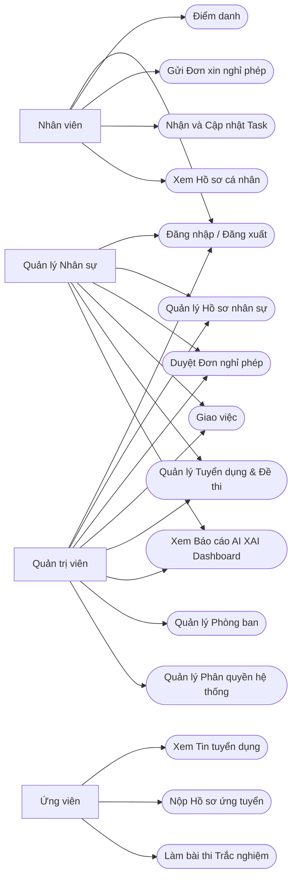
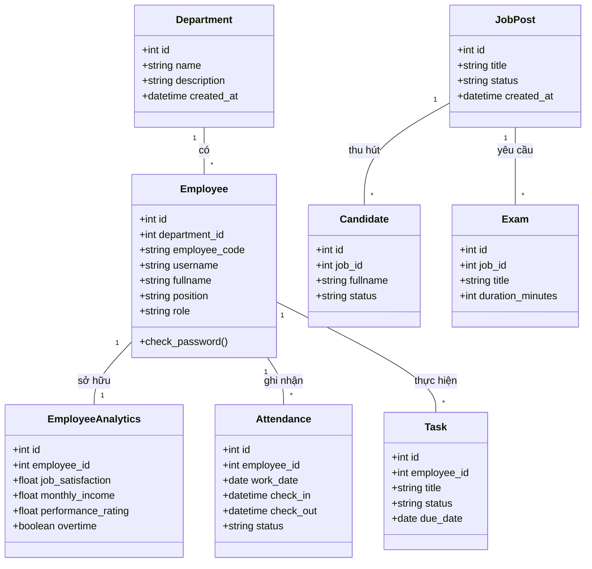
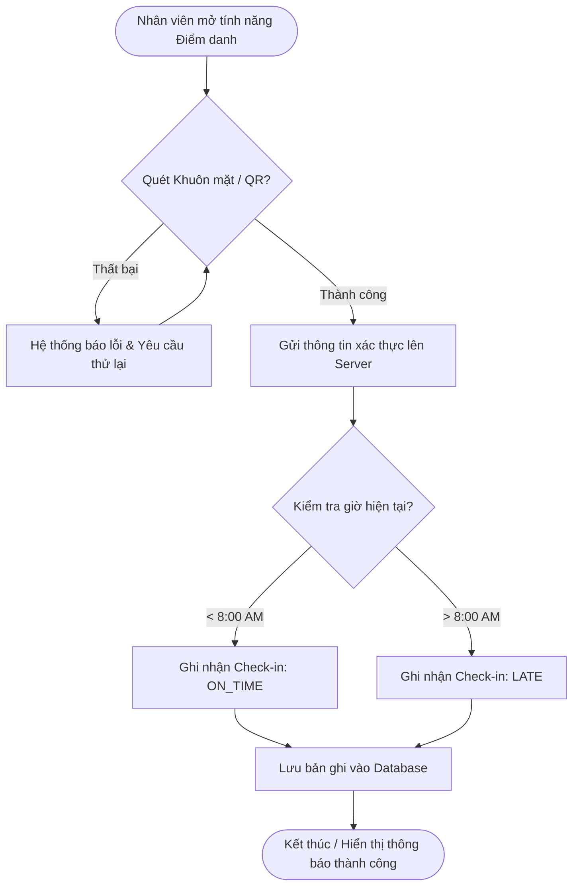
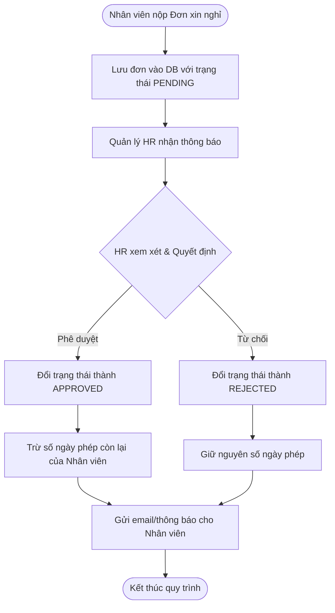
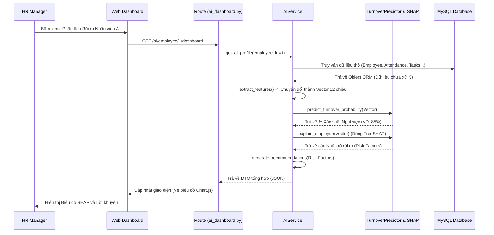

# Tổng hợp Các Biểu đồ UML (UML Diagrams)

Tài liệu này cung cấp các biểu đồ thiết kế hệ thống quan trọng bằng ngôn ngữ Mermaid, bao gồm: Use Case, Class Diagram, Activity Diagram, và Sequence Diagram. Bạn có thể sử dụng trực tiếp các biểu đồ này cho báo cáo đồ án của mình.

---

## 1. Biểu đồ Use Case (Use Case Diagram)

Mô tả sự tương tác giữa các tác nhân (Actors) và các chức năng của hệ thống.

---

## 2. Biểu đồ Lớp (Class Diagram)

Mô tả cấu trúc các lớp (Classes/Entities) và mối quan hệ giữa chúng trong Cơ sở dữ liệu ORM.

---

## 3. Biểu đồ Hoạt động (Activity Diagram)

Mô tả luồng nghiệp vụ của tính năng **Điểm danh (Check-in/Check-out)** và **Duyệt nghỉ phép**.

### Quy trình Chấm công bằng Camera/QR

### Quy trình Duyệt Đơn Nghỉ Phép

---

## 4. Biểu đồ Tuần tự (Sequence Diagram)

Mô tả thứ tự các lời gọi hàm và trao đổi thông điệp giữa các đối tượng trong tính năng **Dự báo rủi ro nghỉ việc bằng AI**.

