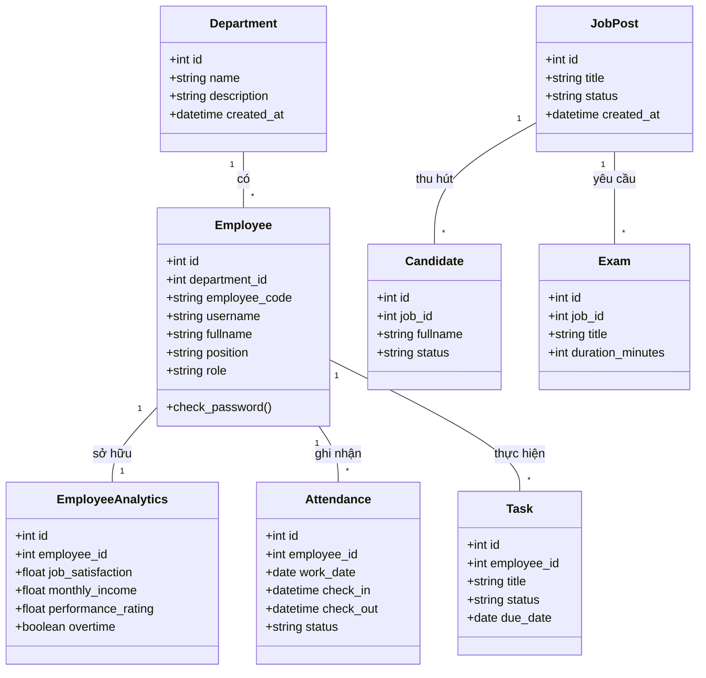
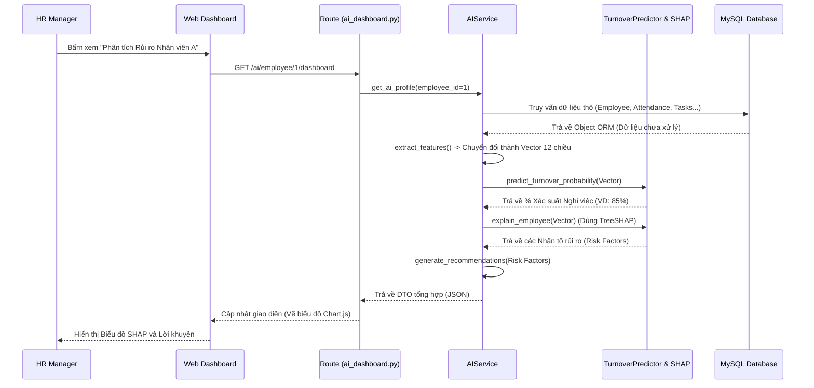

# Tổng hợp Các Biểu đồ UML (UML Diagrams)

Tài liệu này cung cấp các biểu đồ thiết kế hệ thống quan trọng bằng ngôn ngữ Mermaid, bao gồm: Use Case, Class Diagram, Activity Diagram, và Sequence Diagram. Bạn có thể sử dụng trực tiếp các biểu đồ này cho báo cáo đồ án của mình.

---

## 1. Biểu đồ Use Case (Use Case Diagram)

Mô tả sự tương tác giữa các tác nhân (Actors) và các chức năng của hệ thống.

```mermaid
usecaseDiagram
    actor Employee as "Nhân viên (Employee)"
    actor HR as "Quản lý Nhân sự (HR)"
    actor Admin as "Quản trị viên (Admin)"
    actor Candidate as "Ứng viên (Candidate)"
    
    %% Chức năng của Ứng viên
    usecase "Xem Tin tuyển dụng" as UC_C1
    usecase "Nộp Hồ sơ ứng tuyển" as UC_C2
    usecase "Làm bài thi Trắc nghiệm (Exam)" as UC_C3
    
    Candidate --> UC_C1
    Candidate --> UC_C2
    Candidate --> UC_C3

    %% Chức năng của Nhân viên
    usecase "Đăng nhập / Đăng xuất" as UC_E1
    usecase "Điểm danh (Check-in/out)" as UC_E2
    usecase "Gửi Đơn xin nghỉ phép" as UC_E3
    usecase "Nhận và Cập nhật Task" as UC_E4
    usecase "Xem Hồ sơ cá nhân" as UC_E5
    
    Employee --> UC_E1
    Employee --> UC_E2
    Employee --> UC_E3
    Employee --> UC_E4
    Employee --> UC_E5

    %% Chức năng của HR
    usecase "Quản lý Hồ sơ nhân sự" as UC_H1
    usecase "Duyệt Đơn nghỉ phép" as UC_H2
    usecase "Giao việc (Giao Task)" as UC_H3
    usecase "Quản lý Tuyển dụng & Đề thi" as UC_H4
    usecase "Xem Báo cáo AI (XAI Dashboard)" as UC_H5
    
    HR --> UC_E1
    HR --> UC_H1
    HR --> UC_H2
    HR --> UC_H3
    HR --> UC_H4
    HR --> UC_H5

    %% Quản trị viên kế thừa HR và thêm chức năng
    usecase "Quản lý Phòng ban" as UC_A1
    usecase "Quản lý Phân quyền hệ thống" as UC_A2
    
    Admin --> UC_E1
    Admin --> UC_H1
    Admin --> UC_H2
    Admin --> UC_H3
    Admin --> UC_H4
    Admin --> UC_H5
    Admin --> UC_A1
    Admin --> UC_A2
```

---

## 2. Biểu đồ Lớp (Class Diagram)

Mô tả cấu trúc các lớp (Classes/Entities) và mối quan hệ giữa chúng trong Cơ sở dữ liệu ORM.



---

## 3. Biểu đồ Hoạt động (Activity Diagram)

Mô tả luồng nghiệp vụ của tính năng **Điểm danh (Check-in/Check-out)** và **Duyệt nghỉ phép**.

### Quy trình Chấm công bằng Camera/QR


### Quy trình Duyệt Đơn Nghỉ Phép


---

## 4. Biểu đồ Tuần tự (Sequence Diagram)

Mô tả thứ tự các lời gọi hàm và trao đổi thông điệp giữa các đối tượng trong tính năng **Dự báo rủi ro nghỉ việc bằng AI**.


