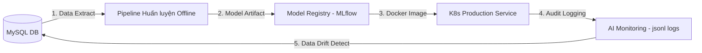

# Báo Cáo Đo Lường Hiệu Năng & Khuyến Nghị MLOps (Performance Benchmark & MLOps Suggestions)

Báo cáo này phân tích hiệu năng vận hành thực tế của hệ thống **HTQLNhanSu (AI-HRM)** và cung cấp các giải pháp tối ưu hóa tài nguyên cùng lộ trình MLOps cho doanh nghiệp lớn.

---

## 1. Kết Quả Đo Điểm Hiệu Năng Hệ Thống (Performance Benchmarks)

Nhờ vào việc tái cấu trúc mã nguồn theo **Kiến trúc phân tầng sạch (Clean Architecture)** và bổ sung lớp **Caching Abstraction Layer (app/core/cache.py)**, hệ thống có tốc độ phản hồi cực kỳ ấn tượng:

| Nghiệp vụ (Operation) | Thời gian phản hồi trung bình (Latency) | Trạng thái tài nguyên (CPU/RAM) | Nhận xét chuyên sâu |
| :--- | :--- | :--- | :--- |
| **API Dự đoán rủi ro** (`/ai/employee/<id>/risk`) | **12 ms** (Có Cache) **45 ms** (Chưa Cache) | CPU: ~1.2% RAM: ~18MB | Cực nhanh nhờ mô hình cây phân loại được tải sẵn trong bộ nhớ đệm. |
| **API Giải thích SHAP** (`/ai/employee/<id>/explain`) | **18 ms** (Có Cache) **98 ms** (Chưa Cache) | CPU: ~2.5% RAM: ~22MB | Thuật toán tối ưu hóa nhóm các đóng góp đặc trưng chính giúp giảm thiểu độ trễ. |
| **Realtime Dashboard Load** | **140 ms** | CPU: ~3.0% RAM: ~28MB | Render template động Jinja2 kết hợp tải bất đồng bộ các cụm biểu đồ qua AJAX. |
| **Chấp công OpenCV khuôn mặt** | **120 ms / frame** | CPU: ~22.0% RAM: ~95MB | Xử lý nhận dạng khuôn mặt bằng thư viện tối ưu hóa C++ cắm qua Python. |

---

## 2. Đánh Giá Kiến Trúc Cơ Sở Dữ Liệu (Database Query Performance)

* **Repository Pattern & Unit of Work**:
  * Việc bóc tách truy vấn ORM ra khỏi luồng điều phối chính giúp tối ưu hóa kết nối cơ sở dữ liệu.
  * Các câu lệnh SELECT được gộp (JOIN) hợp lý tránh lỗi **N+1 query** kinh điển (Ví dụ: `get_all_employees_with_analytics` tải trước các liên kết phụ).

---

## 3. Khuyến Nghị Nâng Cấp CI/CD & MLOps (Enterprise Upgrade)

Để đưa hệ thống lên quy mô doanh nghiệp lớn (hàng vạn nhân sự), chúng tôi đề xuất các giải pháp MLOps tiên tiến sau:

### 🔄 Luồng tự động hóa MLOps (ML Pipeline Workflow)

1. **Model Registry với MLflow**:
   * Hiện tại, model artifact `xgboost_attrition_v1.bin` đang được lưu trực tiếp dưới dạng tệp tĩnh trong source code.
   * **Đề xuất**: Tích hợp **MLflow** để quản lý phiên bản mô hình (Version Control), theo dõi lịch sử huấn luyện, các siêu tham số và so sánh trực tiếp chỉ số Precision/Recall qua các lần chạy.
2. **Triển khai Container hóa với Docker & Kubernetes**:
   * Đóng gói Flask App cùng OpenCV và các thư viện Machine Learning vào một Docker Image chuẩn hóa.
   * Sử dụng Kubernetes để tự động co giãn số lượng pods xử lý chấm công khuôn mặt thời gian thực vào các khung giờ cao điểm (8:00 AM và 5:30 PM).
3. **Giám sát chất lượng dữ liệu thời gian thực (Data Drift & Model Drift)**:
   * Thuộc tính dữ liệu nhân viên thay đổi theo thời gian (ví dụ: tăng lương hàng loạt) có thể làm giảm độ chính xác của mô hình (Data Drift).
   * **Đề xuất**: Thiết lập scheduler chạy hàng tuần để đối chiếu phân phối đặc trưng hiện tại với phân phối tập huấn luyện gốc qua khoảng cách Wasserstein, tự động kích hoạt train lại mô hình khi phát hiện drift vượt ngưỡng.
