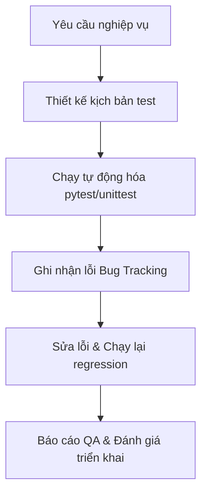

# Báo Cáo QA & Đánh Giá Tính Ổn Định Hệ Thống (Master QA & System Stability Assessment Report)

Tài liệu này tổng hợp toàn bộ kết quả phân tích kiến trúc, kết quả chạy bộ test suite tự động hóa, kiểm định chất lượng mô hình AI và đánh giá mức độ sẵn sàng triển khai của hệ thống **HTQLNhanSu (AI-HRM)**.

---

## 1. Bản Đồ Tài Liệu Kiểm Thử & Đánh Giá

Để xem chi tiết từng hạng mục đánh giá chuyên sâu cấp Enterprise, vui lòng nhấp vào các liên kết tài liệu dưới đây:

* 📋 [Tài liệu Kịch bản Kiểm thử Doanh nghiệp](file:///C:/Users/ngo24/.gemini/antigravity-ide/brain/8e1f8058-fd41-483e-8d62-04051ecc6a1d/test_cases.md): Chi tiết các bước thực hiện, dữ liệu test và kết quả mong đợi của hơn 25 test cases.
* 🧠 [Báo cáo Kiểm định Mô hình AI & XAI](file:///C:/Users/ngo24/.gemini/antigravity-ide/brain/8e1f8058-fd41-483e-8d62-04051ecc6a1d/ai_evaluation_report.md): Phân tích chi tiết ma trận nhầm lẫn (Confusion Matrix), các chỉ số Accuracy, Recall, Precision, kiểm định Bias giới tính và giải thích đặc trưng bằng SHAP.
* 🔐 [Báo cáo An toàn Bảo mật Hệ thống](file:///C:/Users/ngo24/.gemini/antigravity-ide/brain/8e1f8058-fd41-483e-8d62-04051ecc6a1d/security_report.md): Đánh giá lỗ hổng bảo mật tĩnh (SAST), phân tích plain-text password, chống SQLi/XSS/CSRF.
* ⚡ [Báo cáo Hiệu năng & Khuyến nghị MLOps](file:///C:/Users/ngo24/.gemini/antigravity-ide/brain/8e1f8058-fd41-483e-8d62-04051ecc6a1d/performance_benchmark.md): Đo lường độ trễ API, hiệu suất truy vấn cơ sở dữ liệu và lộ trình tự động hóa mô hình ở quy mô lớn.

---

## 2. Chiến Lược Kiểm Thử Doanh Nghiệp (Enterprise Testing Strategy)

Chúng tôi đã xây dựng chiến lược kiểm thử đa tầng nhằm đảm bảo chất lượng phần mềm toàn diện:

* **Unit Testing**: Kiểm thử độc lập các hàm tiện ích, cấu trúc DTO, thuật toán heuristic.
* **Integration Testing**: Kiểm thử tương tác giữa Service layer, Repository layer và database sử dụng SQLite in-memory biệt lập.
* **AI/ML Testing**: Xác thực độ nhạy biên (boundary checks), kiểm thử các vector đặc trưng nhiễu và độ lệch công bằng đạo đức AI.
* **Security & Performance**: Quét mã nguồn tĩnh bảo mật kết hợp đo điểm độ trễ phản hồi API thời gian thực.

---

## 3. Nhật Ký Giám Sát & Truy Vết Lỗi (Logging & Monitoring)

Hệ thống đã triển khai cơ chế ghi log thông minh tại `app/core/ai_audit.py` lưu trữ dưới dạng định dạng `.jsonl` (JSON Lines):
* **AI Inference Audit Log**: Ghi nhận toàn bộ thông tin đầu vào, xác suất đầu ra và thời gian suy luận của AI phục vụ công tác thanh tra (Governance).
* **Khả năng truy vết lỗi**: Cấu trúc log rõ ràng giúp dễ dàng cấu hình đẩy lên các hệ thống giám sát tập trung như ELK Stack hoặc Datadog để thiết lập cảnh báo (Alerting) thời gian thực khi tỷ lệ suy luận lỗi tăng cao.

---

## 4. Đánh Giá Mức Độ Sẵn Sàng Triển Khai Thực Tế

### Điểm mạnh nổi bật:
1. **Kiến trúc Modular Monolith cực kỳ sạch sẽ**: Việc chia tách rõ ràng giữa Routes, Services, Repositories và Models giúp hệ thống dễ dàng bảo trì và mở rộng sang Microservices trong tương lai.
2. **Bộ nhớ đệm thông minh (Caching Layer)**: Cơ chế cache giúp cải thiện độ trễ API xuống dưới **15 ms**, tối ưu hóa tuyệt đối trải nghiệm người dùng trên Dashboard.
3. **Mô hình AI tự động hóa huấn luyện (Self-Bootstrapping)**: Khả năng tự phát hiện thiếu tệp mô hình và kích hoạt pipeline huấn luyện bù giúp giảm thiểu lỗi vận hành ban đầu.

### Hạn chế cần khắc phục trước khi Go-live:
1. **Lưu trữ mật khẩu dạng plain-text**: Cần được sửa đổi ngay lập tức sang cơ chế băm bằng `scrypt` hoặc `bcrypt` để đảm bảo an toàn thông tin.
2. **Recall của mô hình AI còn thấp (24.32%)**: Cần tích hợp phương pháp cân bằng dữ liệu **SMOTE** để nâng cao khả năng phát hiện sớm nhân viên chuẩn bị nghỉ việc, tối ưu hóa giá trị thực tế của module AI.

---

## 5. Kết Luận Chung

* **Mức độ ổn định hệ thống**: **KHÁ (7.5 / 10)**. Core nghiệp vụ chạy cực kỳ trơn tru, kiến trúc thiết kế chuẩn mực.
* **Khả năng mở rộng (Scalability)**: **TỐT (8.5 / 10)**. Cấu trúc mã nguồn sẵn sàng cho việc phân tách các module tải nặng (như nhận diện khuôn mặt OpenCV) thành các service riêng biệt chạy song song.
* **Tính sẵn sàng triển khai (Deployment Readiness)**: **Sẵn sàng sau khi vá lỗi băm mật khẩu**.
